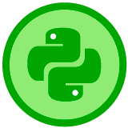

<div align="center">
  <h1>Introducción al Pensamiento Computacional con Python
</h1>
</div>

<div align="center"> 
  
</div>

El contenido de este documento busca ser una guía a través de los conceptos del pensamiento computacional. El mismo está dictado por [David Aroesti](https://github.com/jdaroesti) del team Platzi.

## Tabla de contenidos
- [Algoritmos básicos](#Algoritmos-básicos)
    - [Enumeración exhaustiva](#Enumeración-exhaustiva)
    - [Aproximación de soluciones](#Aproximacion-de-soluciones)
    - [Busqueda binaria](#Busqueda-binaria)
- [Recursividad](#Recursividad)
- [Tipos estructurados, mutabilidad y funciones de alto nivel](#Tipos-estructurados-mutabilidad-y-funciones-de-alto-nivel)
    - [Funciones como objetos](#Funciones-como-objetos)
    - [Tuplas](#Tuplas)
    - [Rangos](#Rangos)
    - [Listas](#Listas)
    - [Diccionarios](#Diccionarios)
- [Pruebas y debugging](#Pruebas-y-debugging)
    - [Pruebas de caja negra](#Pruebas-de-caja-negra)
    - [Pruebas de caja cristal](#Pruebas-de-caja-cristal)
    - [Debugging](#Debugging)
- [Excepciones y afimaciones](#Excepciones-y-afimaciones)
    - [Manejo de excepciones](#Manejo-de-excepciones)
    - [Excepciones como control de flujo](#Excepciones-como-control-de-flujo)
    - [Afirmaciones](#Afirmaciones)


## Algoritmos básicos

#### Enumeración exhaustiva. 
[Práctica](https://github.com/francomanca93/Escuela-DataScience/blob/master/introduccion-al-pensamiento-computacional/enumeracion.py)

Tambien llamado ["busqueda de fuerza bruta"](https://es.wikipedia.org/wiki/B%C3%BAsqueda_de_fuerza_bruta) o "adivida y verifica".

Consiste en enumerar sistemáticamente todos los posibles candidatos para la solución de un problema, con el fin de chequear si dicho candidato satisface la solución al mismo. 
  
Uno de los primero algoritmos en los que hay que pensar.

#### Aproximacion de soluciones. 
[Práctica](https://github.com/francomanca93/Escuela-DataScience/blob/master/introduccion-al-pensamiento-computacional/aproximacion.py)

Similar al algoritmo de Enumeración exhaustiva, pero no necesita una respuesta exacta.

Si nos queremos aproximar a una solucion tenemos que definir que tan cerca queremos estar de esta. A esto lo llamamos epsilon, diferencia entre la realidad y la aproximación. Es el error que estamos dispuesto a cometer. Ejemplo de errores que llamamos epsilon:
- 1% = 1/100 = 0.01 
- 5% = 5/100 = 0.05

Como siempre en programación debemos hacer un trade-off, no podemos ser precisos y rápidos a la ves, por lo tanto cuando nuestro epsilon es muy pequeño esto significa que debemos realizar mas iteraciones para llegar a la aproximación, lo cual significa sacrificar tiempo. Y por otro lado si queremos que nuestro tiempo de ejecución sea lo mas corto posible debemos sacrificar la precisión aumentando el valor de epsilon.

#### Busqueda binaria. 
[Práctica](https://github.com/francomanca93/Escuela-DataScience/blob/master/introduccion-al-pensamiento-computacional/busqueda_binaria.py)

[Busqueda binaria](https://es.wikipedia.org/wiki/B%C3%BAsqueda_binaria) es un algoritmo de búsqueda que encuentra la posición de un valor en un array ordenado.​ 

Compara el valor con el elemento en el medio del array, si no son iguales, la mitad en la cual el valor no puede estar es eliminada y la búsqueda continúa en la mitad restante hasta que el valor se encuentre.


[Programa uniedo todos los algoritmos básicos utilizando funciones.](https://github.com/francomanca93/Escuela-DataScience/blob/master/introduccion-al-pensamiento-computacional/funciones.py)

## Recursividad

[Recursividad](https://es.wikipedia.org/wiki/Recursi%C3%B3n_(ciencias_de_computaci%C3%B3n))

Deficion algoritmica: Forma de crear soluciones utilizando el concepto de "divide y venceras". Esto significa que un problema podemos resolverlo utilizando versiones mas pequeñas del mismo problema. Se trata de encontrar una solucion base facil de resolver y utilizarla para que iterativamente encontremos la solucion del problema.

Deficion programatica: Funcion que se llama a si misma.

Aplicando recusividad
- [Factorial](https://github.com/francomanca93/Escuela-DataScience/blob/master/introduccion-al-pensamiento-computacional/factoriales.py)

<div align="center"> 
  
</div>

- [Fibonacci](https://github.com/francomanca93/Escuela-DataScience/blob/master/introduccion-al-pensamiento-computacional/fibonacci.py)

<div align="center"> 
  
</div>


## Tipos estructurados, mutabilidad y funciones de alto nivel

#### Funciones como objetos

En Python todo es un objeto. En Python las funciones:
- Tienen un tipo
- Se pueden pasar como argumentos de otrasfunciones
    - Las funciones ueden recibir otrasfunciones para crear abstracciones máspoderosas.
- Se pueden utilizar en expresiones
    - Una forma de definir una función en unaexpresión es utilizando el keyword lambda.lambda tiene la siguiente sintaxis:```lambda <vars>: <expresion>```
- Se pueden incluir en varias estructuras dedatos (como listas, tuplas, diccionarios, etc.)

#### Tuplas
[Documentación de python de Tuplas](https://docs.python.org/3/library/stdtypes.html#tuple)
- Secuencias inmutables de objetos. Es una lista de valores que no podemos modificar.
- Pueden contener cualquier tipo de valor.
- Puede utilizarse para devolver varios valores en una función.

#### Rangos
[Documentación de python de Rangos](https://docs.python.org/3/library/stdtypes.html#range)
- Representan una secuencia de enteros.
- range(comienzo, fin, pasos)
- Son inmutables.
- Eficientes en el uso de memoria y normalmente utilizados en for loops.

#### Listas
[Documentación de python de Listas](https://docs.python.org/3/library/stdtypes.html#list)
##### Listas y mutabilidad
- Son secuencias de objetos y mutables.
- Cuando modificas un lista, pueden existir efectos secundarios (side effects).
- Es posible iterar con ellas.
- Para modificar una lista podemos:
    - Asignar via indices (my_list[0] = 5)
    - Utiilzar los metodos de la lista (append, pop, remove, insert, etc)
##### Clonar
- Para evitar errores, o bugs se pueden CLONAR
        - Clonar es mejor que mutar.
        - Para clonar una lista podemos usar slice (ej: ``` d = a[::]```) o la funcion list.
##### List comprenhesion
- Forma concisa de aplicar operaciones a los valores de una secuencia.
- Tambien se pueden aplicar condiciones para filtrar. 
- Ejemplo:
```py
my_list = list(range(100))
double = [i * 2 for i in my_list]
pares = [i for i in my_list if i % 2 == 0]
```

#### Diccionarios
[Documentación de python de Diccionarios](https://docs.python.org/3/library/stdtypes.html#dict)
- Son como listas, pero en lugar de usar indices utilizan llaves. 
- Las llaves son como hashmap. Los hash generar valores unicos que nos permiten acceder a los valores del diccionario de forma SUPER EFICIENTE.
- No tienen orden interno.
- Los diccionarios son mutables.
- Pueden iterarse. 
```py
my_dict = {
    'Franco': 26,
    'Maxi': 25,
    'Fede': 25,
}

# Iterar por hash o llaves
for llave my_dict.keys():
    print(llave)

# Iterar por valor
for valor my_dict.value():
    print(valor)
```


## Pruebas y debugging

Las pruebas asumen que existe el código. Se crean las pruebas, luego el codigo. 

### Pruebas de caja negra
[Practica](https://github.com/francomanca93/Escuela-DataScience/blob/master/introduccion-al-pensamiento-computacional/caja_negra.py)

- Se basan en la especificacion de la función o el programa. 
- Se prueban inputs y se validan outputs. 
- Se asume que no conocemos la implmentación.

Importantes para 2 tipos de test:
- **Unit testing**. Se prueba funcion por funcion.Viendo que cada modulo funcione correctamente.
- **Integreation testing**. Se ve como todo un conjuntoy se hacen pruebas para corroborar que todo funcionacomo un tal.

En Python se llama a Test Driven development a las pruebas que queremos realizar a los metodos que queremos crear. Se puede utilizar el módulo que nos permite generar pruebas, [unittest](https://docs.python.org/3.8/library/unittest.html): ```import unittest```. 

Se trata de escribir test primero, lo cual se puede detectar posibles errores. Cuando se plantean los test de una funcion, se pueden plantear las posibles soluciones. 

### Pruebas de caja cristal 
[Practica](https://github.com/francomanca93/Escuela-DataScience/blob/master/introduccion-al-pensamiento-computacional/caja_cristal.py)
- Se basan en el flujo del programa. 
- Se prueban todos los caminos posibles de una función. Ramificaciones, bucles for y while, recursión.

Importantes para:
- **Regression testing o mocks**: Descubrir un bug despues de que el programa salio a producción.
    - Test Ramificaciones:
        - if
        - elif
        - else
    - Test Loop:
        - No entrar al loop
        - Entrar una vez al loop
        - Entrar mas de una vez al loop
    - Test recursion: Igual que el caso de test loop


### Debugging

Un bug es un error o un defecto en el software o hardware que hace que un programa funcione incorrectamente.

La mejor forma de evitar bugs es tener test. 
#### Reglas generales: 
- No te molestes con el debugger. Aprender a utilizar el print statement. Esto no da una mirada de lo que esta sucediendo dentro del algoritmo. Esto nos genera datos.
- Estudia los datos disponibles.
- Utiliza los datos para crear hipótesis y experimentos. Método científico.
- Ten una mente abierta. Si entendieras el programa, probablmente no habrían bugs.
- Lleva un registro de los que has tratado, preferentemente en la forma de tests. 

#### Diseño de experimentos
Debuguear es un proceso de búsqueda de los bugs, por lo que al diseñar nuestros experimentos debemos acotar el espacio de búsqueda en cada prueba. 

Una forma ágil de debugear es utilizando una búsqueda binaria con print statements, esto significa que ejecutamos la mitad del código, si no falla entonces sabemos que el problema esta en la otra mitad, y en cada área que vamos acortando lo dividimos por mitades, de esta forma hallaremos rápidamente nuestro bug.

#### Errores comunes:

- Encuentra a los sospechosos comunes (llamado a una función mal escrita, parámetros en orden incorrecto, etc.)
- En lugar de preguntarte por qué un programa no funciona, pregúntate por qué está funcionando de esta manera.
- Es posible que el bug no se encuentre donde crees que está.
- Explícale el problema a otra persona. De preferencia que no tenga contexto.- Lleva un registro de lo que has tratado, preferentemente en la forma de tests.
- Vete a dormir.

# Excepciones y afimaciones

Las excepciones se usan para manejar errores que sabemos que van a suceder en el software que realizamos. Estas son muy comunes en la programación y se relacioan con errores de semántica. Existe la posibilidad de crear excepciones propias si estas no existieran.

**Cuando una excepcion no se maneja, el programa finaliza en error.**

#### Manejo de excepciones

[Practica](https://github.com/francomanca93/Escuela-DataScience/blob/master/introduccion-al-pensamiento-computacional/excepciones.py)

Las excepciones se manejan con los keywords:``` try, except, finally```. Estas tambien pueden utilizarse para ramificar programas. 

Una **mala práctica** es manajar las excepciones de manera silenciosa. Esto ocurre cuando utilizado, por ejemplo, print statements.

Para aventar tu propia excepcion utiliza el keyword raise + nombre de la excepcion. 

Existen dos casos de uso de excepciones:
- Como usuario de una función. 
- Programación defensiva. Utilizando excepciones dentro de la función. 

#### Excepciones como control de flujo

[Practica](https://github.com/francomanca93/Escuela-DataScience/blob/master/introduccion-al-pensamiento-computacional/flujo-en-excepciones.py)

Python ofrece estructuras para contro de flujo ```(if... elif...else)```; entonces, ¿por qué es necesaria otra modalidad para controlar el flujo? Una razón muy específica: el principio EAFP (*easier to ask for forgiveness than permission, es más fácil pedir perdón que permiso*, por sus siglas en inglés).

El principio EAFP es un estilo de programación común en Python en el cual se asumen llaves, índices o atributos válidos y se captura la excepción si la suposición resulta ser falsa. 
```py
def busca_pais(paises, pais):
    """
    Paises es un diccionario. Pais es la llave.
    Codigo con el principio EAFP.
    """
    
    try:
        return paises[pais]
    except KeyError:
        return None
```
Es importante resaltar que otros lenguajes de programación favorecen el principio LBYL (*look before you leap, revisa antes de saltar*) en el cual el código verifica de manera explícita las precondiciones antes de realizar llamadas.
```javascript
// Javascript

/**
* Paises es un objeto. Pais es la llave.
* Codigo con el principio LBYL.
*/
function buscaPais(paises, pais) {
  if(!Object.keys(paises).includes(pais)) {
    return null;
  }

  return paises[pais];
}
```

El código de Python accede directamente a la llave y únicamente
si dicho acceso falla, entonces se captura la excepción y se provee el código necesario. 

En el caso de JavaScript, se verifica primero que la llave exista en el objeto y únicamente con posterioridad se accede.

#### Afirmaciones
Mecanismo mediante el cual podemos determinar si una condición se cumple o no. En función de esto seguir adelante con el programa o terminar dicha ejecución.

Es un método de programación defensiva. Se puede utilizar para verificar los tipos de datos de entrada (input) de una función sean correctos.

Sirve para debuguear. 

[Utilizando asserts con excepciones](https://github.com/francomanca93/Escuela-DataScience/blob/master/introduccion-al-pensamiento-computacional/afirmaciones.py)
 