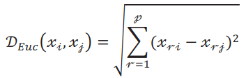
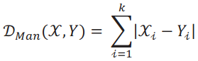
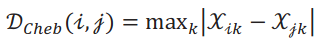
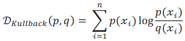
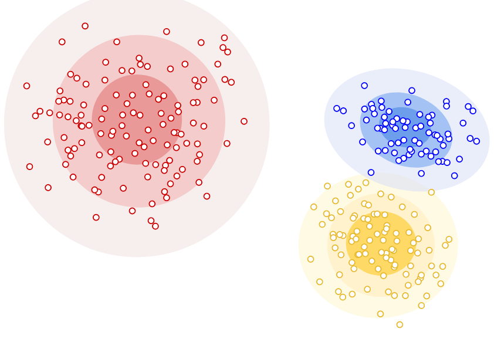
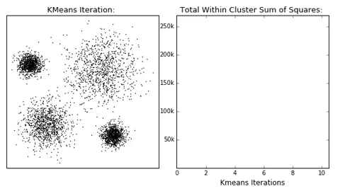
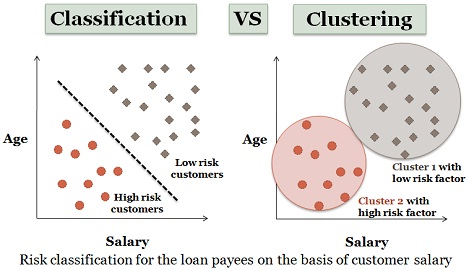

<div align="center">
  <h1>Introducción al Pensamiento Probabilístico
</h1>
</div>

<div align="center"> 
  
</div>

# Introducción al documento

El contenido de este documento son apuntes del [Curso de Introducción al Pensamiento Probabilístico](https://platzi.com/clases/probabilistica/) y busca ser una guía. El mismo está dictado por [David Aroesti](https://github.com/jdaroesti) del team [Platzi](https://platzi.com).

### Objetivos del documento
- Desarrollar el pensamiento probabilistico. Este nos permitirá entender:
    - Como calcular las probabilidades de lo que sucede a nuestro alrededor.
    - Como actualizar estas probabilidades conforme se va teniendo expereciencia y evidencia del mundo.
- Una introducción al Machine Learning y a los algoritmos de clasificación.

# Tabla de contenido
- [Programación probabilística](#Programación-probabilística)
    - [Introducción a la programación probabilística](#Introducción-a-la-programación-probabilística)
    - [Probabilidad condicional](#Probabilidad-condicional)
    - [Teorema de Bayes](#Teorema-de-Bayes)
    - [Aplicando Teorema de Bayes](#Aplicando-Teorema-de-Bayes)
    - [Aplicaciones del Teorema de Bayes](#Aplicaciones-del-Teorema-de-Bayes)
- [Mentiras estadísticas](#Mentiras-estadísticas)
    - [Garbage in, garbage out](#Garbage-in,-garbage-out)
    - [Imágenes engañosas](#Imágenes-engañosas)
    - [Cum Hoc Ergo Propter Hoc](#Cum-Hoc-Ergo-Propter-Hoc)
    - [Prejuicio en el muestreo](#Prejuicio-en-el-muestreo)
    - [Falacia del francotirador de Texas](#Falacia-del-francotirador-de-Texas)
    - [Porcentajes confusos](#Porcentajes-confusos)
    - [Falacia de regresión](#Falacia-de-regresión)
    - [Tabla resumen de mentiras estadísticas](#Tabla-resumen-de-mentiras-estadísticas)

- [Introducción a Machine Learning](#Introducción-a-Machine-Learning)
    - [Feature vectors](#Feature-vectors)
    - [Métricas de distancia](#Métricas-de-distancia)
- [Agrupamiento](#Agrupamiento)
    - [Introducción al agrupamiento](#Introducción-al-agrupamiento)
    - [Agrupamiento jerárquico](#Agrupamiento-jerárquico)
    - [Agrupamiento K-means](#Agrupamiento-K-means)
    - [Otras técnicas de agrupamiento](#Otras-técnicas-de-agrupamiento)
- [Clasificación](#Clasificación)
    - [Introducción a la clasificación](#Introducción-a-la-clasificación)
    - [Clasificación K-nearest neighbors](#Clasificación-K-nearest-neighbors)
    - [Otras tecnicas de clasificación](#Otras-tecnicas-de-clasificación)


## Programación probabilística
### Introducción a la programación probabilística

La **programación probabilística** utiliza [_probabilidades_](https://es.wikipedia.org/wiki/Teor%C3%ADa_de_la_probabilidad) y [_modelos probabilísticos_](https://es.wikipedia.org/wiki/Modelo_probabil%C3%ADstico) para ejecutar cómputos. Se utiliza en una gran cantidad campos: investigación científica, inteligencia artificial, medicina, etc.

Existen lenguajes y librerías especializadas para ejecutar este tipo de cómputo, como [_Pyro_](https://pyro.ai/) de [Uber](https://www.uber.com/ar/en/).

### Probabilidad condicional

La [**probabilidad condicional**](https://es.wikipedia.org/wiki/Probabilidad_condicionada) es la probabilidad de que ocurra un evento _A_, sabiendo que también sucede otro evento _B_. La probabilidad condicional se escribe **_P(A|B)_**, y se lee **_«la probabilidad de A dado B»_**.

No tiene por qué haber una relación causal o temporal entre _A_ y _B_. _A_ puede preceder en el tiempo a _B_, sucederlo o pueden ocurrir simultáneamente. _A_ puede causar _B_, viceversa o pueden no tener relación causal. Las relaciones causales o temporales son nociones que no pertenecen al ámbito de la probabilidad. Pueden desempeñar un papel o no, dependiendo de la interpretación que se le dé a los eventos.

La notación para escribir,

_«la probabilidad de A y B suceden»_: `P(A and B) = P(A) * P(B_` 

_«la probabilidad de B»_: `P(B) = P(A) * P(B|A) + P(Ac) * P(B|Ac)`

Un ejemplo de esto puede ser la probabilidad que una persona **tenga cáncer**, luego de realizar pruebas.

`P(cancer) = P(positivo) * P(cancer|positivo) + P(negativo) * P(cancer|negativo)`

Otro ejemplo es cual es la probabilidad de que una persona **use drogas**, pero como dato adicional esta persona es músico.

`P(drogas) = P(musico) * P(drogas|musico) + P(no sea musico) * P(drogas|no sea musico)`

### Teorema de Bayes

El [**teorema de Bayes**](https://es.wikipedia.org/wiki/Teorema_de_Bayes), en la teoría de la probabilidad, es una proposición planteada por el matemático inglés [Thomas Bayes](https://es.wikipedia.org/wiki/Thomas_Bayes) (1702-1761)​ y publicado en 1763, tras su muerte.
<br>
<div align="center">
    
</div>
<br>

Este expresa que la probabilidad condicional de un evento aleatorio _A_ dado _B_ en términos de la distribución de probabilidad condicional del evento _B_ dado _A_ y la distribución de probabilidad marginal de solo _A_.

En términos más generales y menos matemáticos, el teorema de Bayes es de enorme relevancia puesto que vincula la probabilidad de _A_ dado _B_ con la probabilidad de _B_ dado _A_. 

Por ejemplo, sabiendo la probabilidad de tener un dolor de cabeza dado que se tiene gripe, se podría saber (si se tiene algún dato más), la probabilidad de tener gripe si se tiene un dolor de cabeza. Muestra este sencillo ejemplo la alta relevancia del teorema en cuestión para la ciencia en todas sus ramas, puesto que tiene vinculación íntima con la comprensión de la probabilidad de aspectos causales dados los efectos observados.

> Sea  un conjunto de sucesos mutuamente excluyentes y exhaustivos, y tales que la probabilidad de cada uno de ellos es distinta de cero (0). Sea B un suceso cualquiera del que se conocen las probabilidades condicionales . Entonces, la probabilidad  viene dada por la expresión:
> <br>
> <div align="center">
>     
> </div>
> <br>
> 
> donde:
> -  son las probabilidades a priori,
> -  es la probabilidad de  en la hipótesis ,
> -  son las probabilidades a posteriori.


> Como sabemos que  podemos reemplazarlo en la ecuación y nos quedaría:
> <br>
> <div align="center">
>     
> </div>
> <br>

#### Entendiendo teorema de bayes

En el siguiente enlace hay una excelente explicación animada del [Teorema de Bayes en 3Blue1Brown](https://www.youtube.com/watch?v=HZGCoVF3YvM&t).

En las sigueints imagenes se puede ver el Teorema de Bayes y una representación visual del mismo. 

<br>
<div align="center">
    
</div>
<div align="center">
    
</div>
<br>

Analicemos la gráfica 
- _P(H) = 13%_. **Probabilidad a priori** (Hipotesis)
- _P(E|H) = 35%_ (El 35% de P(H)). Probabilidad del Evento **E** dada la probabilidad de la Hipotesis **H**.
- _P(¬H) = 100% - 13%_. Probabilidad de que no ocurra la Hipotesis. 
- P(E|¬H) = 13% (El 13% de P(¬H)). Probabilidad del Evento **E** dada la probabilidad de la Hipotesis no ocurra **¬H**.
- _P(H|E) = 28%_. **Probabilidad a posteriori**. Probabilidad de la Hipotesis **H** dada la probabilidad de que ocurra el Evento **E**  .

_P(H|E) = P(H) * P(E|H) / (P(H) * P(E|H) + P(¬H) * P(E|¬H))_ = (0,13×0,35)÷(0,13×0,35 + (1−0,13)×0,13)

En el siguiente enlace se puede aplicar lo anterior descripto y jugar con diferentes probabilidades del [Teorema de Bayes de forma gráfica](https://www.skobelevs.ie/BayesTheorem/).

### Aplicando Teorema de Bayes

En el siguiente ejercicio se analizará los síntomas que alguien tiene antes de presentarse al médico y poder determinar cual es la probabilidad de que tenga cierta enfermedad. En este caso, la enfermedad será cancer. 

<br>
<div align="center">
    
</div>
<br>

Analizando variables:
- **H**ipótesis = Tener cancer. 
    - _P(H) = 1 / 100 000 = 0,00001 = 0,001%_
- **E**videncia = Presentar síntomas.
- ¬**H**ipótesis = No tener cancer. 
    - _P(¬H) = 1 - P(H)= 0,99999 = 99,999%_
- P(E|H) = Probabilidades de presentar síntomas dado que tenga cancer.
    - _P(E|H) = 1 = 100%_
- P(E|¬H) = Probabilidades presentar síntomas dado que no tenga cancer.
    - _P(E|¬H) = 10 / 99999 = 0,000100001 = 0,0100001%_

[Script](https://github.com/francomanca93/Escuela-DataScience/blob/master/introduccion-al-pensamiento-probabilistico/scripts/sintomas.py) que cálcula el teorema de bayes.

```py
def calcular_bayes(priori_H, prob_E_dado_H, prob_E):
    '''Teorema de Bayes.
    
    Variables de entrada:
    - priori_H = probabidad de la hipótesis
    - prob_E_dado_H = probabidad de la evidencia dada la hipótesis
    - prob_E = probabilidad de la evidencia

    return (priori_H * prob_E_dado_H) / prob_E
    '''
    return (priori_H * prob_E_dado_H) / prob_E

def prob_E(priori_H, prob_E_dado_H, prob_E_no_dado_H):
    '''Función que regresa la probabilidad de la evidencia.

    Variables de entrada:
    - priori_H = probabidad de la hipótesis
    - prob_E_dado_H = probabidad de la evidencia dada la hipótesis
    - prob_E_no_dado_H = probabilidad de la evidencia no dada la hipótesis

    return (priori_H * prob_E_dado_H) + (no_priori_H * prob_E_no_dado_H)
    '''
    no_priori_H = 1 - priori_H
    return (priori_H * prob_E_dado_H) + (no_priori_H * prob_E_no_dado_H)


if __name__ == '__main__':
    prob_cancer = 1 / 100000
    prob_sintoma_dado_cancer = 1
    prob_sintoma_dado_no_cancer = 10 / 99999
    prob_no_cancer = 1 - prob_cancer

    prob_sintoma = prob_E(prob_cancer, prob_sintoma_dado_cancer, prob_sintoma_dado_no_cancer)
    prob_cancer_dado_sintoma = calcular_bayes(prob_cancer, prob_sintoma_dado_cancer, prob_sintoma)

    print(prob_cancer_dado_sintoma)
```

Salida:
```
0.09090909090909091
```

### Aplicaciones del Teorema de Bayes

El Teorema de Bayes es uno de los mecanismos matemáticos más importantes en la actualidad. A grandes rasgos, nos permite medir nuestra certidumbre con respecto a un suceso tomando en cuenta nuestro conocimiento previo y la evidencia que tenemos a nuestra disposición. El Teorema de Bayes permea en tu vida diaria, desde descubrimientos científicos hasta coches autónomos, el Teorema de Bayes es el motor conceptual que alimenta mucho de nuestro mundo moderno.
​

En esta lectura me gustaría darte ejemplos de cómo se utiliza en la vida moderna para que puedas comenzar a implementarlo en tus proyectos, análisis y hasta en
tu vida personal.

#### Turing y el código enigma de los Nazis

​
Casi todos sabemos que [Alan Turing](https://es.wikipedia.org/wiki/Alan_Turing) es uno de los padres del cómputo moderno; pocos saben que fue gracias a él que los aliados pudieron tener una ventaja decisiva cuando Turing logró descifrar el código enigma que encriptaba todas las comunicaciones nazis; pero aún menos saben que para romper este código utilizó el Teorema de Bayes.

<br>
<div align="center">
    
    <p><b>Alan Turing</b></p>
</div>
<br>

Lo que hizo Turing fue aplicar el Teorema para descifrar un segmento de un mensaje, calcular las probabilidades iniciales y actualizar las probabilidades
de que el mensaje era correcto cuando nueva evidencia (pistas) era presentada.

#### Finanzas

Una de las decisiones más difíciles cuando estás manejando un portafolio de inversión es determinar si un instrumento financiero (acciones, valores, bonos, etc.) se va a apreciar en el futuro y por cuánto, o si, por el contrario se debe vender el instrumento. Los portafolios managers más exitosos utilizan el Teorema de Bayes para analizar sus portafolios.
​

En pocas palabras, puedes determinar las probabilidades iniciales basándote en el rendimiento previo de tu portafolio o en el rendimiento de toda la bolsa y
luego añadir evidencia (estados financieros, proyecciones del mercado, etc.) para tener una mayor confianza en las decisiones de venta o compra.

#### Derecho

El Derecho es uno de los campos más fértiles para aplicar pensamiento bayesiano. Cuando un abogado quiere defender a su cliente, puede comenzar a evaluar una probabilidad de ganar (basada en su experiencia previa, o en estadísticas sobre el número de juicios y condenados con respecto del tema legal que competa) y actualiza su probabilidad conforme vayan sucediendo los eventos del proceso jurisdiccional.
​

Cada nueva notificación, cada prueba y evidencia que encuentre, etc. sirve para actualizar la confianza del abogado.

#### Inteligencia artificial

El Teorema de Bayes es central en el desarrollo de sistemas modernos de inteligencia artificial. Cuando un coche autónomo se encuentra navegando en las calles, tiene que identificar todos los objetos que se encuentran en su “campo de visión” y determinar cuál es la probabilidad de tener una colisión. Esta probabilidad se actualiza con cada movimiento de cada objeto y con el propio movimiento del vehículo autónomo. Esta constante actualización de probabilidades es lo que permite que los vehículos autónomos tomen decisiones
acertadas que eviten accidentes.
​

En esta rama existen muchos ejemplos como para cubrirlos todos, pero quiero por lo menos mencionar algunos casos de uso: 
- filtros de spam.
- reconocimiento de voz.
- motores de búsqueda.
- análisis de riesgo crediticio
- ofertas automáticas, 
- y un largo etcétera.
​

## Mentiras estadísticas

Aunque nuestro software este bien estructurado, hay veces que el mismo puede arrojarnos errores, estos errores son como un tercer nivel de bugs, donde podemos identicar a 3:
1. **Error de Sintaxis**. Error tradicional.
2. **Error de Lógica**. Bugs mas complejos.
3. **Error en el diseño del software**. Esto se debe por la forma en la que pensamos y llegamos a conclusiones. Bugs que no están en el programa en sí. Son los más difíciles de encontrar.  

En esta sección veremos diferentes errores de pensamientos que nos podemos encontrar y que debemos aprender a detectar cuando estemos frente a uno. 

### Garbage in, garbage out
La calidad de nuestros datos es igual de fundamental que la precisión de nuestros cómputos. Cuando los datos son errados, aunque tengamos un cómputo excelente nuestro resultado serán erróneos.

En pocas palabras: con datos errados las conclusiones serán erradas.

### Imágenes engañosas

Las visualizaciones son muy importantes para entender un conjunto de datos. Errores que pueden confundir o manipular y llegar a conclusiones erroneas cuando analizamos gráficas pueden ser: 
- **Variación de escalas.** Cuando se juega con la escala se puede llegar a conclusiones incorrectas.
- **Sin Etiquetas.** Si no hay etiquetas, no se puede llegar a una conclusión. 
- **Sin escalas.** Si no hay escalas, no podemos comparar. 

**Nunca se debe confiar en una gráfica sin escalas o etiquetas.**

### Cum Hoc Ergo Propter Hoc

[Cum Hoc Ergo Propter Hoc](https://es.wikipedia.org/wiki/Cum_hoc_ergo_propter_hoc) significa _Después de esto, eso_; ó _entonces a consecuencia de esto, eso_. 

Esto es una falacia (es decir, un argumento que parece válido, pero que no lo es) que se comete al inferir que dos o más eventos están conectados causalmente porque se dan juntos.

La falacia consiste en inferir que existe una relación causal entre dos o más eventos por haberse observado una correlación estadística entre ellos. Esta falacia muchas veces se refuta mediante la frase **correlación no implica causalidad**. 

Dos variables están positivamente correlacionadas cuando se mueven en la misma dirección y negativamente correlacionadas cuando se mueven en direcciones opuestas. Esta correlación no implica causalidad.

Puede existir variables escondidas que generen la correlación.

Analizando la falacia: 
> En general, la falacia reside en que, dados dos eventos A y B, al descubrir una correlación estadística entre ambos, es un error inferir que A causa B sin antes considerar la validez de al menos una de las siguientes cuatro posibilidades:
> - Que B sea la causa de A.
> - Que haya un tercer factor desconocido que sea realmente la causa de la relación entre A y B.
> - Que la relación sea tan compleja y numerosa que los hechos sean simples coincidencias.
> - Que B sea la causa de A y al mismo tiempo A sea la de B, es decir, que estén de acuerdo, que sea una relación sinérgica o simbiótica donde la unión cataliza los efectos que se observan.

### Prejuicio en el muestreo

Para que un [muestra estadística](https://es.wikipedia.org/wiki/Muestra_estad%C3%ADstica) pueda servir como base para la inferencia estadística tiene que ser aleatorio y representativo.

Una muestra representativa es una pequeña cantidad ___algo___ que refleja, con la mayor precisión posible, a un grupo más grande. 

El prejuicio en el muestreo elimina la representatividad de las muestras.

A veces conseguir muestras es difícil, por lo que se utiliza a la población de más fácil acceso (ejemplo: en caso estudios universitarios), esto se debe evitar si queremos que nuestra sea representativa.

### Falacia del francotirador de Texas

[Falacia del francotirador](https://es.wikipedia.org/wiki/Falacia_del_francotirador) Esta falacia lógica se da cuando no se toma la aleatoriedad en consideración, es decir, donde la información que no tiene relación alguna es interpretada, manipulada o maquillada hasta que ésta parezca tener un sentido. También sucede cuando uno se enfoca en las similitudes e ignora las diferencias.

El nombre viene de un tirador que disparó aleatoriamente varios tiros a un granero y después pintó una diana centrada en cada uno de los tiros para autoproclamarse francotirador. 

Cuando fallamos al tener una hipótesis antes de recolectar datos estamos en alto riesgo de caer en esta falacia (muy común en Data Science).

### Porcentajes confusos

Cuando no sabemos la cuenta total de donde se obtiene un porcentaje tenemos el riesgo de concluir falsos resultados. 

Los porcentajes son una medida **RELATIVA**, significa que varían en **RELACIÓN** a el dato que estemos tomando.

Por eso **siempre** es importante ver el contexto ya que los porcentajes, en vacio, no significan mucho o básicamente nada.

### Falacia de regresión

La [falacia de la regresión](https://es.wikipedia.org/wiki/Falacia_de_la_regresi%C3%B3n) o falacia del retroceso es una falacia en la que se asume una causa donde no existe.

Muchos eventos fluctúan naturalmente, por ejemplo, la temperatura promedio de una ciudad, el rendimiento de un atleta, los rendimientos de un portafolio de inversión, etc.

Antes de continuar cabe destacar que es la [regresión a la media](https://es.wikipedia.org/wiki/Regresi%C3%B3n_a_la_media). Este es el fenómeno en el que si una **variable es extrema** en su primera medición, tenderá a estar más cerca de la media en su segunda medición y, paradójicamente, si es extrema en su segunda medición, tenderá a haber estado más cerca de la media en su primera.

Ahora, hay que tener en cuenta que cuando algo fluctúa y se aplican medidas correctivas se puede creer que existe un vínculo de causalidad en lugar de una regresión a la media.

### Tabla resumen de mentiras estadísticas

| Conceptos | Definiciones |
| --------- | ------------ |
| Garbage in, garbage out | Si le insertas datos basuras, recibirás resultados basuras. |
| Imágenes engañosas | Conclusiones incorrectas, escalas que no tienen sentido, o falta de etiqueta en un gráfico. |
| Cum Hoc Ergo Propter Hoc | Error de asignar causalidad cuando sólo existe correlación. |
| Prejucios en el muestreo | Muestra no aleatoria o no representativa |
| Falacia del francotirador de texas | No tomar la aleatoriedad en consideración de nuestro pensamiento. Enfocarse en las similitudes e ignorar las diferencias. |
| Porcentajes confusos | Falta de información respecto al contexto o la fuente de los datos. |
| Falacia de regresión | Pensar que existe un vínculo de causalidad cuando en realidad se trata de regresión a la media. |

## Introducción a Machine Learning

El [Machine Learning](https://es.wikipedia.org/wiki/Aprendizaje_autom%C3%A1tico) es el subcampo de las ciencias de la computación y una rama de la inteligencia artificial. Se define como:

> "Es el campo de estudio que le da a las computadoras la habilidad de aprender sin ser explícitamente programadas." - Arthur Samuel, 1959.

- Machine learning se utiliza cuando:
    - Programar un algoritmo es imposible. 
    - El problema es muy complejo o no se conocen altoritmos para resolverlo.
    - Ayuda a los humanos a entender patrones (data mining).

[Principales hitos en la historia de la inteligencia artificial](https://ecosistemahuawei.xataka.com/principales-hitos-historia-inteligencia-artificial/).

Excelente video del canal de [DotCSV](https://www.youtube.com/channel/UCy5znSnfMsDwaLlROnZ7Qbg) donde hace un [mapa conceptual de que es el Machine Learning, Deep Learning e Inteligencia Artificial.](https://youtu.be/KytW151dpqU?list=PL-Ogd76BhmcDxef4liOGXGXLL-4h65bs4) 

- Los tipos de algoritmos de Machine Learning pueden ser: 
    - [**Aprendizaje supervisado.**](https://es.wikipedia.org/wiki/Aprendizaje_supervisado) El algoritmo produce una función que establece una correspondencia entre las entradas y las salidas deseadas del sistema.
    - [**Aprendizaje No supervisado.**](https://es.wikipedia.org/wiki/Aprendizaje_no_supervisado) Todo el proceso de modelado se lleva a cabo sobre un conjunto de ejemplos formado tan sólo por entradas al sistema. No se tiene información sobre las categorías de esos ejemplos.
    - [**Aprendizaje por refuerzo**](https://es.wikipedia.org/wiki/Aprendizaje_por_refuerzo). El algoritmo aprende observando el mundo que le rodea. Su información de entrada es el feedback o retroalimentación que obtiene del mundo exterior como respuesta a sus acciones. Por lo tanto, el sistema aprende a base de ensayo-error.

En este video de DotCSV sobre los [tipos de algoritmos de Machine Learning](https://youtu.be/oT3arRRB2Cw?list=PL-Ogd76BhmcDxef4liOGXGXLL-4h65bs4) se puede ver canceptualmente mas en profundidad.

- Batch vs online learning.
    - Batch learning: El módelo se genera una sola vez y se aplica.
    - Online learning: Se genera el modelo y se va actualizando constantemente conforme entran datos.

### Feature vectors

Se utilizan para representar características simbólicas o numéricas llamadas [__features__](https://en.wikipedia.org/wiki/Feature_(machine_learning)). Permiten analizar un objeto desde una perspectiva matemática.

Los algoritmos de machine learning típicamente requieren representaciones numéricas para poder ejecutar el cómputo.

Uno de los feature vectors más conocidos es la representación del color a través de RGB.

Ejemplos de feature vectors:

- color = [R, G, B]
- Procesamiento de imágenes: Gradientes, bordes, áreas, colores, etc.
- Reconocimiento de voz: Distancia de sonidos, nivel de ruido, razón ruido / señal, etc.
- Spam: Dirección IP, estructura del texto, frecuencia de palabras, encabezados, etc.


### Métricas de distancia

Muchos de los algoritmos de machine learning pueden clasificarse como algoritmos de optimización. Lo que desean optimizar es una función que en muchas ocasiones se refiere a la distancia entre features (caracteristicas).

Existen diferentes tipos de distancias, las cuales se querran optimizar. Cada distancia servirá para tipos diferentes de aplicaciones.

- [Distancia Euclidiana](https://es.wikipedia.org/wiki/Distancia): distancia en línea recta o la trayectoria más corta posible entre dos puntos.

<br>
<div align="center">
    
    <p><b>Distancia Euclidiana</b></p>
</div>
<br>

- [Distancia Manhattan](https://es.wikipedia.org/wiki/Geometr%C3%ADa_del_taxista): calcula la distancia que se puede recorrer para llegar de un punto de datos a la otra si un camino en forma de rejilla es seguido. La distancia Manhattan entre dos elementos es la suma de las diferencias de sus correspondientes componentes.

<br>
<div align="center">
    
    <p><b>Distancia de Manhattan</b></p>
</div>
<br>

<br>
<div align="center">
    
    <p>Distancia Euclidiana(verde) vs Distancia de Manhattan(rojo, azul y amarillo)</p>
</div>
<br>


- [**Distancia Chebyshev**](https://es.wikipedia.org/wiki/Distancia_de_Chebyshov): métrica definida en un espacio vectorial donde la distancia entre dos vectores es el mayor de sus diferencias a lo largo de cualquier dimensión de coordenadas.

<br>
<div align="center">
    
    <p><b>Distancia Chebyshev</b></p>
</div>
<br>

- [**Distancia Kullback-Leibler**](https://es.wikipedia.org/wiki/Divergencia_de_Kullback-Leibler): es una medida no simétrica de la similitud o diferencia entre dos funciones de distribución de probabilidad P y Q. KL mide el número esperado de extra bits requeridos en muestras de código de P cuando se usa un código basado en Q, en lugar de un código basado en P. Generalmente P representa la “verdadera” distribución de los datos, observaciones, o cualquier distribución teórica. La medida Q generalmente representa una teoría, modelo, descripción o aproximación de P.

<br>
<div align="center">
    
    <p><b>Distancia Kullback-Leibler</b></p>
</div>
<br>

En el siguiente enlace se hace un [estudio comparativo sobre medidas de similitud y disimilitud en la agrupación de datos continuos](https://journals.plos.org/plosone/article/figure?id=10.1371/journal.pone.0144059.t001)

## Agrupamiento
### Introducción al agrupamiento

[Algoritmo de agrupamiento o Clustering](https://es.wikipedia.org/wiki/Algoritmo_de_agrupamiento) es un proceso mediante el cual se agrupan objetos similares en clusters que los identifican. Se clasifican como aprendizaje no supervisado, ya que no requiere la utilización de etiquetas.

<br>
<div align="center">
    
    <p><b>Ejemplo de distribución basada en Clustering</b></p>
</div>
<br>


Permite entender la estructura de los datos y la similitud entre los mismos.

Las técnicas de agrupamiento encuentran aplicación en diversos ámbitos, entre ellos:
- En biología para clasificar animales y plantas.
- En medicina para identificar enfermedades.
- En marketing para identificar personas con hábitos de compras similares.
- En teoría de la señal pueden servir para eliminar ruidos.
- En biometría para identificación del locutor o de caras.

### Agrupamiento jerárquico

El [agrupamiento jerarquico](https://es.wikipedia.org/wiki/Agrupamiento_jer%C3%A1rquico) es un algoritmo que agrupa objetos similares en grupos llamados clusters. 

El algoritmo comienza tratando a cada objeto como un cluster individual y luego realiza los siguientes pasos de manera recursiva:

- Identifica los 2 clusters con menor distancia (lo más similares).
- Agrupa los 2 clusters en 1 nuevo.

El output final es un dendrograma que muestra la relación entre objetos y grupos.

<br>
<div align="center">
    
    <p>Izquierda:<b> Formación de Clusters.</b></p>
    <p>Derecha:<b> Dendrograma</b></p>
</div>
<br>

Es importante determinar qué medida de distancia vamos a utilizar y los puntos a utilizar en cada cluster (linkage criteria).


### Agrupamiento K-means

[Agrupamiento K-Means](https://es.wikipedia.org/wiki/K-medias) es un método de agrupamiento, que tiene como objetivo la partición de un conjunto de n observaciones en k grupos en el que cada observación pertenece al grupo cuyo valor medio es más cercano. 

<br>
<div align="center">
    
    <p><b> Agrupamiento K-Means</b></p>
</div>
<br>

1. K centroides iniciales (en este caso k=4) son generados aleatoriamente dentro de un conjunto de datos (mostrados en color). 
2. k grupos son generados asociándole el punto con la media más cercana. La partición aquí representa el diagrama de Voronoi generado por los centroides. 
3. EL centroide de cada uno de los k grupos se recalcula. 
4. Pasos 2 y 3 se repiten hasta que se logre la convergencia. 


### Otras técnicas de agrupamiento

El [agrupamiento](https://es.wikipedia.org/wiki/An%C3%A1lisis_de_grupos) es una técnica de Machine Learning que consiste, en pocas palabras, en dividir una población en grupos con la consecuencia de que los datos en un grupo son más similares entre ellos que entre los otros grupos.

​
Imagina que eres el dueño de una startup que hace e-commerce y quieres tener estrategias de venta para tus clientes. Es casi imposible diseñar una estrategia por cada individuo, pero se puede utilizar el agrupamiento para dividir a los clientes en grupos que tengan similitudes relevantes y así reducir el problema a unas cuantas estrategias.

​
Existen dos tipos de agrupamiento:

- **Agrupamiento estricto (hard clustering)**: en el cual cada dato pertenece a un grupo u otro. No hay puntos medios.

- **Agrupamiento laxo (soft clustering)**: en el cual en lugar de asignar un dato a un grupo, se asigna probabilidades a cada dato de pertenecer o no a un grupo.
    ​

Un punto muy importante que debes considerar cuando ejecutas técnicas de agrupamiento es que debes definir muy claro a qué te refieres cuando hablas de similitud entre puntos, porque esto puede ayudarte a definir el algoritmo correcto para tus necesidades particulares.


A grandes rasgos existen cuatro aproximaciones para definir similitud:


- [**Modelos conectivos**](https://es.wikipedia.org/wiki/An%C3%A1lisis_de_grupos#Agrupamiento_basado_en_conectividad_(agrupamiento_jer%C3%A1rquico)): Estos modelos asumen que los puntos más similares son los que se encuentran más cercanos en el espacio de búsqueda. Recuerda que este espacio puede ser altamente dimensional cuando tus feature vectors definen muchas características a analizar. Una desventaja de este tipo de modelos es que no escalan para conjuntos de datos grandes (aunque es posible utilizar una muestra y aplicar técnicas de estadística inferencial para obtener resultados).

- [**Modelos de centroide**](https://es.wikipedia.org/wiki/An%C3%A1lisis_de_grupos#Agrupamiento_basado_en_centroide): Este tipo de modelos definen similitud en términos de cercanía con el centroide del grupo. Los datos se agrupan al determinar cuál es el centroide más cercano.

- [**Modelos de distribución**](https://es.wikipedia.org/wiki/An%C3%A1lisis_de_grupos#Agrupamiento_basado_en_distribuciones): Este tipo de modelos trata de asignar probabilidades a cada dato para determinar si pertenecen a una distribución específica o no (por ejemplo, normal, binomial, Poisson, etc.).

- [**Modelos de densidad**](https://es.wikipedia.org/wiki/An%C3%A1lisis_de_grupos#Agrupamiento_basado_en_densidad): Estos modelos analizan la densidad de los datos en diferentes regiones y dividen el conjunto en grupos. Luego asignan los puntos de acuerdo a las áreas de densidad en las que se haya dividido el dataset.

​
No hay que quedarse con un modelo específico. Muchos Ingenieros de Machine Learning y Científicos de Datos utilizan varios modelos con el mismo conjunto de datos para analizar el rendimiento de los diversos algoritmos que tienen a su disposición. Así que hay que experimentar y siempre comparar los resultados antes de tomar una decisión.


## Clasificación
### Introducción a la clasificación

La [clasificación](https://es.wikipedia.org/wiki/Clasificaci%C3%B3n_estad%C3%ADstica) es el problema de identificar a cuál de un conjunto de categorías (subpoblaciones) pertenece una nueva observación, sobre la base de un conjunto de datos de formación que contiene observaciones (o instancias) cuya categoría de miembros es conocida. Es un tipo de aprendizaje supervisado, ya que para que funcione, se necesitan etiquetas con los datos (labels).

Un ejemplo sería asignar a un correo electrónico dado la clasificación de "spam" o "no spam", o asignar un diagnóstico a un paciente dado según las características observadas del paciente (género, presión arterial, presencia o ausencia de ciertos síntomas, etc.).

Tambien se utiliza en muchos otros dominios, incluyendo la medicina, aprobación crediticia, reconocimiento de imágenes, vehículos autónomos, entre otros.

Sigue dos pasos: aprendizaje (creación del modelo) y clasificación.

<br>
<div align="center">
    
    <p><b></b></p>
</div>
<br>

### Clasificación K-nearest neighbors
### Otras tecnicas de clasificación