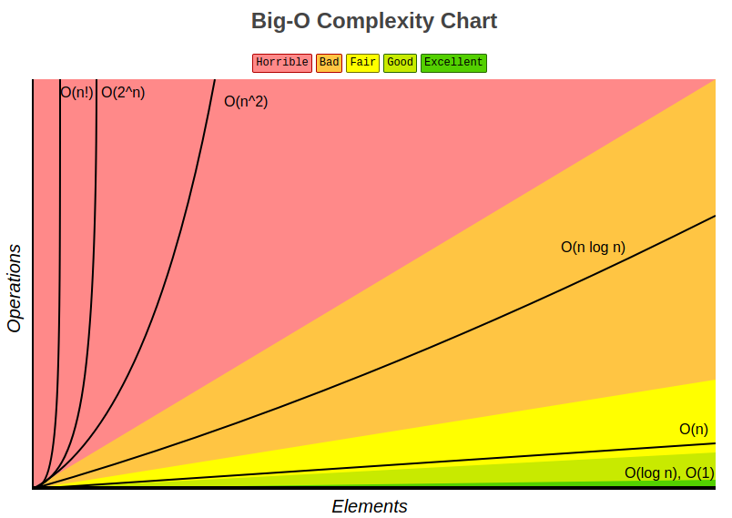
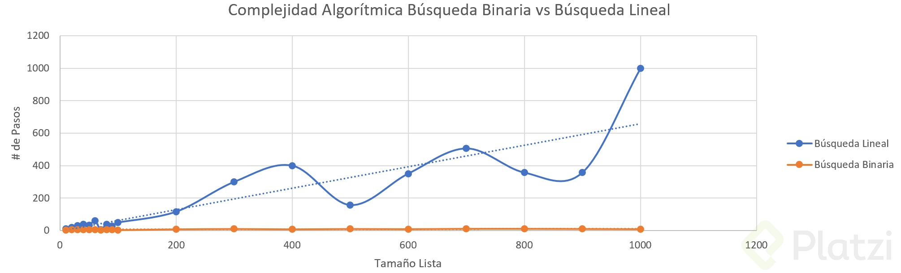

<div align="center">
  <h1>Programación orientada a objetos y Algoritmos con Python</h1>
</div>

<div align="center"> 
  
</div>

### Objetivos
El contenido de este documento son apuntes del [Curso de POO y Algoritmos con Python](https://platzi.com/clases/poo-python/) y busca ser una guía a través de los conceptos de la programación orientada a objetos y algoritmos. El mismo está dictado por [David Aroesti](https://github.com/jdaroesti) del team [Platzi](https://platzi.com).

Objetivos del documento:
- Entender como funciona la Programación orientada a Objetos
- Entender cómo medir la eficiencia temporal y espacial de nuestro algoritmos.
- Entender cómo y por qué graficar.
- Aprender a resolver problemas de búsqueda, ordenación y optimización.

## Tabla de contenido 
- [Programación orientada a objetos](#Programación-orientada-a-objetos)
    - [Programación orientada a objetos en Python](#Programación-orientada-a-objetos-en-python)
    - [Tipos de datos abstractos](#Tipos-de-datos-abstractos)
    - [Decomposición](#Decomposición)
    - [Abstracción](#Abstracción)
    - [Encapsulación y getters and setters](#Encapsulación-y-getters-and-setters)
    - [Herencia](#Herencia)
    - [Polimorfismo](#Polimorfismo)
- [Complejidad algorítmica](#Complejidad-algorítmica)
    - [Introducción a la complejidad algorítmica](#Introducción-a-la-complejidad-algorítmica)
    - [Conteo abstracto de operación](#Conteo-abstracto-de-operación)
    - [Crecimiento asintótico](#Crecimiento-asintótico)
    - [Clases de complejidad algorítmica](#Clases-de-complejidad-algorítmica)
- [Algoritmos de búsqueda y ordenación](#Algoritmos-de-búsqueda-y-ordenación)
    - [Busqueda Lineal](#Busqueda-Lineal)
    - [Busqueda binaria](#Busqueda-binaria)
    - [Ordenamiento de burbuja](#Ordenamiento-de-burbuja)
    - [Ordenamiento por inserción](#Ordenamiento-por-inserción)
    - [Ordenamiento por mezcla](#Ordenamiento-por-mezcla)
- [Ambientes virtuales](#Ambientes-virtuales)

- [Graficar](#Graficar)

- [Algoritmos de optimización](#Algoritmos-de-optimización)


## Programación orientada a objetos

### Programación orientada a objetos en Python

[Más info en Wiki](https://es.wikipedia.org/wiki/Programaci%C3%B3n_orientada_a_objetos)

Uno de los elementos más importantes de los lenguajes de programación es la utilización de clases para organizar programas en módulos y abstracciones de datos.

La clave para entender la programación orientada a objetos es pensar en objetos como agrupaciones de datos y los métodos que operan en dichos datos.

La programación orientada a objetos nos permite modelar cosas reales y concretas del mundo y sus relaciones con otros objetos.

Por ejemplo: 
- Representar a una persona con propiedades como nombre, edad, género, etc. y los comportamientos de dicha persona como caminar, cantar, comer, etc. 
- Representar unos audífonos con propiedades como su marca, tamaño, color, etc. y sus comportamientos como reproducir música, pausar y avanzar a la siguiente canción.

Cuando decimos "Los objetos son las principales cosas que un programa de Python manipula. Cada objeto tiene un tipo que define qué cosas puede realizar un programa con dicho objeto.", nos estamos refiriendo a las ideas principales de la programación orientada a objetos. Hemos utilizado los tipos lista y diccionario, entre muchos otros, así como los métodos asociados a dichos tipos.

Así como los creadores de un lenguaje de programación sólo pueden diseñar una fracción muy pequeña de todas las funciones útiles (como ```abs, float, type```, etc.), también pueden escribir una fracción muy pequeña de los tipos útiles (```int, str, dict, list```, etc.). Ya sabemos los mecanismos que nos permiten crear funciones, ahora veremos los mecanismos que nos permiten crear nuevos tipos (o clases).

#### Clases
Las clases nos permiten crear nuevos tipos que contiene información arbitraria sobre un objeto. En el caso del hotel, podríamos crear dos clases `Hotel()` y `Cuarto()` que nos permitiera dar seguimiento a las propiedades como número de cuartos, ocupación, aseo, tipo de habitación, etc.

Es importante resaltar que las clases sólo proveen estructura. Son un molde con el cual podemos construir objetos específicos. 

Para definir una clase, simplemente utilizamos el keyword class. Por ejemplo:

```py
class Hotel:
    pass
```

La clase señala las propiedades que los hoteles que modelemos tendrán, pero no es ningún hotel específico. Para eso necesitamos las instancias.

#### Instancias
Mientras que las clases proveen la estructura, las instancias son los objetos reales que creamos en nuestro programa: un hotel llamado PlatziHotel o Hilton.

Una vez que tenemos una clase llamada Hotel podemos generar una instancia
llamando al constructor de la clase.

```py
hotel = Hotel()
```

Los atributos de clase nos permiten:

- Representar datos.
- Procedimientos para interactuar con los mismos (métodos).
- Mecanismos para esconder la representación.

Para acceder a los atributos de estos objetos se hace a través de la notación de punto. Además puede tener atributos privados (Por convención comienzan con _ ).


#### Atributos de la instancia
Los atributos de la instancia describen lo que representa el objeto.

Todas las clases crean objetos y todos los objetos tienen atributos. Utilizamos el método especial `__init__` para definir el estado inicial de nuestra instancia.

Recibe como primer parámetro obligatorio `self` (que es simplemente una
referencia a la instancia).
```py
class Hotel:
    
    def __init__(self, numero_maximo_de_huespedes, lugares_de_estacionamiento):
        self.numero_maximo_de_huespedes = numero_maximo_de_huespedes
        self.lugares_de_estacionamiento = lugares_de_estacionamiento
        self.huespedes = 0


hotel = Hotel(numero_maximo_de_huespedes=50, lugares_de_estacionamiento=20)
print(hotel.lugares_de_estacionamiento) # 20
```
#### Método de la instancia

Los métodos de instancia nos indican qué podemos hacer con las instancias de dicha clase y normalmente operan en los mencionados atributos.
Los métodos son equivalentes a funciones dentro de la definición de la clase, pero todos reciben `self` como primer argumento.

```py
class Hotel:

    ...

    def anadir_huespedes(self, cantidad_de_huespedes):
        self.huespedes += cantidad_de_huespedes

    def checkout(self, cantidad_de_huespedes):
        self.huespedes -= cantidad_de_huespedes

    def ocupacion_total(self):
        return self.huespedes


hotel = Hotel(50, 20)
hotel.anadir_huespedes(3)
hotel.checkout(1)
hotel.ocupacion_total() # 2

```

Estructura de la definición de una clase

```py

# definición de clase

# Primero definimos el nombre de la clase y podemos determinar si hereda de otra clase.
class nombre_de_la_clase(super_clase):

    # El método init es un constructor, y siempre los métodos dentro
    # de los parámetros inician con el parámetro self
    def __init__(self, params):
        expresion

    # Las clases pueden tener comportamientos,
    # y estos los definimos con los métodos.
    def nombre_del_metodo(self, params):
        expresion

```

Ejemplo:

```py

# Definición
class Persona:

    def __init__(self, nombre, edad):
        self.nombre = nombre
        self.edad = edad

    def saluda(self, otra_persona):
        return f'Hola {otra_persona.nombre}, me llamo {self.nombre}.'


# Uso
>>> david = Persona('David', 28)
>>> karl = Persona('Karl', 26)
>>> 
>>> david.saluda(karl)
>>> 'Hola Karl, me llamo David'

```

### Tipos de datos abstractos

En Python todo es un objeto y tiene un tipo, esto significa que todo lo que hacemos en nuestro programa tiene una representación en memoria, los datos y el comportamiento se puede encapsular en un objeto.

Los tipos nos permiten modelar y manipular el mundo a través de la programación.

Las formas de interactuar con un objeto son:
- Creación
- Manipulación
- Destrucción

Cuando trabajamos con programación orientada a objetos tenemos varias ventajas:

- **Decomposición**: podemos estructurarlos en objetos mas pequeños.
- **Abstracción**: no nos preocupamos el funcionamiento del proceso de su comportamiento.
- **Encapsulación**: podemos esconder ciertos datos que solo son relevantes internamente en el objeto.

[Primera practica de POO en Python](https://github.com/francomanca93/Escuela-DataScience/blob/master/poo-y-algoritmos/coordenada.py)

### Decomposición

La decomposición es partir un problema en problemas más pequeños. 

Las clases permiten crear mayores abstracciones en forma de componentes. 

Cada clase se encarga de una parte del problema y el programa se vuelve más fácil de mantener.

[Practica](https://github.com/francomanca93/Escuela-DataScience/blob/master/poo-y-algoritmos/decomposicion.py). Ejemplo simple en el cual se trata de modelar un automovil y decomponer en clases que representen a otros objetos, ejemplo, Motor.

### Abstracción

Se trata de enfocarnos en la información relevante. Se debe separar la información central de los detalles secundarios. Para realizar este procedimiento podemos utilizar variables y métodos (privados o públicos). [Más info en Wiki](https://es.wikipedia.org/wiki/Abstracci%C3%B3n_(inform%C3%A1tica))

[Practica](https://github.com/francomanca93/Escuela-DataScience/blob/master/poo-y-algoritmos/abstraccion.py). Ejemplo simple en el cual se trata de modelar una Lavadora y abstraerse del funcionamiento de la misma con métodos ocultos.

### Encapsulación y getters and setters

En programación modular, y más específicamente en programación orientada a objetos, se denomina encapsulamiento al **ocultamiento del estado**, lo que hacemos específicamente es **proteger** los datos miembro de un objeto de manera que solo se pueda cambiar mediante las **operaciones definidas** para ese objeto. [Más info en Wiki](https://es.wikipedia.org/wiki/Encapsulamiento_(inform%C3%A1tica))

Esto nos asegura por ejemplo que “no podremos modificar un atributo si no es a través de un método que hallamos creado específicamente para ello” y aquí es donde nacen los famosos **“Getter, Setter, Deleter”**. Se

**En python las propiedades y métodos privados no existen, por lo que son fácilmente sobre-escribibles.**

#### Atributos protegidos en Python (“_”)
```py
class usuario (object):
	def __init__(self, nombre, clave):
		self.nombre = nombre
		self._clave = clave  # ATRIBUTO PROTEGIDO
		
Usuario1 = usuario ("Roberto", "qwerty")
 
print (Usuario1.nombre, Usuario1._clave)
```

#### Atributos privados en Python (“__”)

En el caso de un atributo privado estamos indicando que este solo podrá ser accedido o modificado si se especifica la clase precedida por un guión bajo seguida del atributo precedido por doble guión bajo.

```py
class usuario (object):
	def __init__(self, nombre, clave):
		self.nombre = nombre
		self.__clave = clave
		
Usuario1 = usuario ("Roberto", "qwerty")
 
print (Usuario1.nombre, Usuario1._usuario__clave)  # FORMA DE ACCEDER AL ATRIBUTO PRIVADO
```

Podemos acceder igualmente a un atributo por más que sea privado y modificarlo de la misma manera. Pero no es lo que se “considera correcto”. Por lo que para ello si deseamos implementar métodos que nos permitan modificar estos atributos de la forma que se suele hacer en otros lenguajes donde se aplica “encapsulamiento” podemos hacerlo utilizando **Getter, Setter, Deleter** mediante el uso del decorador `@Property`.

La función integrada `property()` nos permitirá interceptar la escritura, lectura, borrado de los atributos y ademas nos permiten incorporar una documentación sobre los mismos.

Si nosotros no pasamos alguno de los parámetros su valor por defecto sera None.

- Getter: Se encargará de interceptar la lectura del atributo. (get = obtener)

- Setter : Se encarga de interceptar cuando se escriba. (set = definir o escribir)

- Deleter : Se encarga de interceptar cuando es borrado. (delete = borrar)

- doc :  Recibirá una cadena para documentar el atributo. (doc = documentación)

[Practica](https://github.com/francomanca93/Escuela-DataScience/blob/master/poo-y-algoritmos/encapsulamiento.py). Ejemplo simple en el cual se trata de modelar un Perro y encapsular las propiedades o atributos del mismo. Luego se trata de obtener (get), definir y/o escribir (set) y borrar (delete) estas propiedades utilizando el decorador `@property` con los métodos adecuados para realizar las acciones anteriores.

### Herencia

La [herencia](https://es.wikipedia.org/wiki/Herencia_(inform%C3%A1tica)) permite modelar una jerarquía de clases, con el cual compartiremos comportamientos en común. Al padre se le conoce como superclase y al hijo como subclase.

[Practicando](https://github.com/francomanca93/Escuela-DataScience/blob/master/poo-y-algoritmos/herencia.py). Ejemplo simple en el cual se modela un Rectangulo con su defición. Luego un Cuadrado hereda el comportamiento de esta última sabiendo que es una caso especial donde la base y la altura son iguales. 

#### Herencia simple vs Herencia multiple

La **herencia simple** tiene lugar cuando una clase hija hereda los atributos y métodos de una **única** clase padre.

Para que sea posible la herencia de atributos y métodos de una clase, debe existir la superclase o clase principal de la cual la clase hija o secundaria va a heredar. Es decir, para que exista un hijo debe de existir un padre.

Supongamos que nosotros heredamos algunas virtudes y defectos de nuestros padres. Ellos serían nuestras clases primarias, o base. Y nosotros seríamos la secundaria o hija.

Los casos de **herencia múltiple** en python se dan cuando una clase secundaria o hija hereda atributos y metodos de mas de una clase principal o padre.

#### Ventajas de su aplicación

- Ayuda a ahorrar código y tiempo.

- Los objetos pueden ser construidos a partir de otros similares. Para ello es necesario que exista una clase base (que incluso puede formar parte de una jerarquía de clases más amplia).

- La clase derivada hereda el comportamiento y los atributos de la clase base, y es común que se le añada su propio comportamiento o que modifique lo heredado.

- Toda clase pueden servir como clase base para crear otras.

### Polimorfismo

El [polimorfismo](https://es.wikipedia.org/wiki/Polimorfismo_(inform%C3%A1tica)) es la habilidad de tomar varias formas, en este caso la habilidad de cambiar el comportamiento de un método.Este concepto esta estrechamente ligado con la herencia y que nos permite cambiar el comportamiento de una superclase para adaptarlo a la subclase solo nombrando el método y escribiendo su comportamiento.

[Practica](https://github.com/francomanca93/Escuela-DataScience/blob/master/poo-y-algoritmos/polimorfismo.py). Se crea una clase padre llamada Persona que avanza. La segunda clase Ciclista hereda de Persona, pero avanza en bicicleta. El comportamiento anterior se observa en el ejemplo.


## Complejidad algorítmica

### Introducción a la complejidad algorítmica

La [complejidad algorítmica](https://es.wikipedia.org/wiki/Teor%C3%ADa_de_la_complejidad_computacional) nos permite comparar la eficiencia de 2 algoritmos. Esto a su vez nos permitirá predecir el tiempo que va a tomar resolver un problema.

Podemos analizar la complejidad desde:
- La perspectiva **temporal**. La complejidad algorítmica temporal la podemos definir como T(n) el cual determinara el tiempo que demora en resolver nuestro algoritmo.
- La perspectiva **espacial**, como por ejemplo cuanto espacio en memoria necesitamos.

En Resumen:
1. Podemos medir la complejidad de los problemas y sus respectivos algoritmos.
2. Fundamental en computación.
3. **NO ES LO MISMO** la complejidad de un problema que la forma de resolverlo.

#### Aproximaciones
¿Como podríamos aplicar nuestra función T(n)?

- Cronometrar el tiempo en el que corre un algoritmo. Sin embargo no es una buena forma de medir los algoritmos, ya que no se puede predecir cuanto demorara a medida que crece nuestros pasos.

- Contar los pasos con una medida abstracta de operación. Nos puede acercar a una medición ideal, sin embargo varia mucho de algoritmo en algoritmo y a medida que crece nuestro dataset existen muchos términos que llegan a ser irrelevantes.

- Contar los pasos conforme nos aproximamos al infinito pero con una medida asintótica.

[Practica](https://github.com/francomanca93/Escuela-DataScience/blob/master/poo-y-algoritmos/complejidad_algoritmica.py). En la siguiente práctica se analiza la complejidad algoritmica y se trata de demostrar como el tiempo cambia de un algoritmo iterativo y otro recursivo.

### Conteo abstracto de operación

Con esta técnica contamos los pasos que realiza nuestro algoritmo. En el siguiente ejemplo respuesta tendrá los números de pasos que realiza nuestro código al ejecutar.

```py
def f(x):

    # Primera operación
    respuesta = 0

    # Segunda operacion. Sin importar de x este loop correrá 1000 veces.
    for i in range(1000):
        respuesta += 1

    # Tercera operación. Este loop correrá el valor de x
    for i in range(x):
        respuesta += x

    # Cuarta operación. Esta parte esta corriendo 2 loop. Esto será 2x² 
    for i in range(x):  
        for j in range(x):
            respuesta += 1
            respuesta += 1

    # Quinta operación.
    return respuesta

# Respuesta
# 1002 + x + 2x²
```

Los términos que más importan son los más grandes, osea, conforme nuestro problema se va haciendo más grande sólo nos importa el término más grande.
La **Big O notation** no permitirá analizar los términos mas irrelevantes el algoritrmo y sólo concentrarnos en los mas importantes.

[Práctica](https://github.com/francomanca93/Escuela-DataScience/blob/master/poo-y-algoritmos/conteo_abstracto.py)


### Crecimiento asintótico

¿Como comparar algoritmos?
Podemos tomar el tiempo que tardan estos en correr, pero esto resulta ineficiente y depende del hardware directamente.

La segunda opción es contar la cantidad de pasos que dá el algoritmo. Pero nos dimos cuenta que hay terminos que no importan cuando se van al infinito.


Antes de analizar la mejor forma de analizar un algoritmo se debe entender que es **[Asintótico](https://es.wikipedia.org/wiki/An%C3%A1lisis_asint%C3%B3tico)**. Esto significa que conforme la función se va al infinito o el input crece hacia el infinito. 

Teniendo tal concepto aclarado debemos tener en cuenta que no importan las variaciones pequeñas. Lo que realmente importa es centrarse en lo que pasa conforme el tamaño del problema se acerca al infinito.

Siempre tenemos que estar preparados para cualquier caso, por lo que tenemos que saber medir a nuestro algoritmo en el mejor de los casos, el caso promedio y peor de los casos.

Lo que mejor nos permite comparar y entender cual es la complejidad real algoritmica a la cual nos estamos enfrentando es el peor de los casos. En este caso es cuando entra el **Big O Notation**.

**Big O Notation** lo que importa es nada mas el término de mayor tamaño.

Ejemplos de como poder trabajar con Big O:

#### Ley de la suma

```py
def f(n):
    for i in range(n):
        print(i)

    for i in range(n):
        print(i)

# En este caso el mayor término es n
# O(n) + O(n) = O(n + n) = O(2n) = O(n)
```
#### Ley de la suma 2
```py
def f(n):
    for i in range(n):
        print(i)

    for i in range(n * n):
        print(i)

# En este caso el mayor término es n²
# O(n) + O(n * n) = O(n + n²) = O(n²)
```

#### Ley de la multiplicación

```py
def f(n):

    for i in range(n):

        for i in range(n):
            print(i, j)

# En este caso el mayor término es n²
# O(n) + O(n * n) = O(n * n) = O(n²)
```
#### Recursividad múltiple

```py
def fibonacci(n):

    if n == 0 or n == 1:
        return 1

    return fibonacci(n - 1) +  fibonacci(n - 2)

# En este caso el mayor término es 2**n (el símbolo ** denota "elevado a"),
# ya que realiza recursividad 2 veces por n veces.
# O(2**n)
```
### Clases de complejidad algorítmica

[Big O Notation](https://stackoverflow.com/questions/487258/what-is-a-plain-english-explanation-of-big-o-notation) o **Notación Big O** es la **representación relativa** de la **complejidad** de un algoritmo.

> **Relativa**: Solo puede comparar manzanas con manzanas. No puedes comparar un algoritmo con una multiplicación aritmetica que ordene una lista de enteros. Pero una comparación de dos algorítmos para hacer operaciones aritméticas (una multiplicación, una adición) te dirán algo significativo.

> **Representación**: Big-O reduce la comparación entre algoritmos a una simple variable. Esta variable es elegida basandose en la observación. 

> **Complejidad**: Si algo me toma un segundo en ordenar 10 000 elementos, cuanto me tomará ordenar 1M?. La complejidad en esta instancia es una medida relativa a otra cosa.

Existen distintos tipos de complejidad algorítmica:

- **O(1) Constante:** no importa la cantidad de input que reciba, siempre demorara el **mismo tiempo**.
- **O(n) Lineal:** la complejidad crecerá de forma **proporcional** a medida que crezca el input.
- **O(log n) Logarítmica:** nuestra función crecerá de forma **logarítmica** con respecto al input. Esto significa que en un inicio crecerá rápido, pero luego se estabilizara.
- **O(n log n) Log lineal:** crecerá de forma **logarítmica** pero junto con una **constante**.
- **O(n²) Polinomial:** crecen de forma cuadrática. No son recomendables a menos que el input de datos sea pequeño.
- **O(2^n) Exponencial:** crecerá de forma **exponencial**, por lo que la carga es muy alta. Para nada recomendable en ningún caso, solo para análisis conceptual.
- **O(n!) Factorial:** crece de forma **factorial**, por lo que al igual que el exponencial su carga es muy alta, por lo que jamas utilizar algoritmos de este tipo.

<div align="center"> 
  
</div>

En el siguiente [enlace](https://www.bigocheatsheet.com/) se observa la fuente el gráfico anterior y la clasificación de los algoritmos en función de la complejidad Big-O.

Se puede leer más al respecto en [Eficiencia algorítmica](https://es.wikipedia.org/wiki/Eficiencia_algor%C3%ADtmica).

## Algoritmos de búsqueda y ordenación
Objetivos de esta sección:
1. Aplicar los conceptos de complejidad algoritmica. 
2. Aprender algoritmos de búsqueda y ordenación para resolver problemas. 

### Busqueda Lineal
La [**búsqueda lineal**](https://es.wikipedia.org/wiki/B%C3%BAsqueda_lineal) o la **búsqueda secuencial** es un método para encontrar un valor objetivo dentro de una lista.Ésta comprueba secuencialmente cada elemento de la lista para el valor objetivo hasta que es encontrado o hasta que todos los elementos hayan sido comparados.

En la siguiente [práctica](https://github.com/francomanca93/Escuela-DataScience/blob/master/poo-y-algoritmos/busqueda_lineal.py) se observa el algoritmo escrito. Analizando al mismo ¿Cuál es el peor caso? Si nos fijamos en el [algoritmo](https://github.com/francomanca93/Escuela-DataScience/blob/master/poo-y-algoritmos/busqueda_lineal.py) existe un for loop que crece según el tamaño de la lista, por lo cual nuestro Big O es **O(n)**.

### Busqueda binaria
La [búsqueda binaria](https://es.wikipedia.org/wiki/B%C3%BAsqueda_binaria) toma una estrategia llamada "Divide y conquista", la cual consiste en dividir el problema en 2 en cada iteración. Este algoritmo asume que la lista se encuentra ordenada, por lo que es necesario realizar este paso primero.

La búsqueda binaria es uno de los mejores algoritmos que se tienen hoy en día para búsqueda, ya que reduce significativamente el numero de pasos, y así disminuyendo nuestro Big O.

En la siguiente [practica](https://github.com/francomanca93/Escuela-DataScience/blob/master/poo-y-algoritmos/busqueda_binaria.py) se muestra el algoritmo de busqueda binaria. 

La búsqueda binaria es computada en el peor de los casos en un tiempo logarítmico, realizando **O(log n)** comparaciones, donde n es el número de elementos del arreglo y log es el logaritmo. La búsqueda binaria requiere solamente O(1) en espacio, es decir, que el espacio requerido por el algoritmo es el mismo para cualquier cantidad de elementos en el array.

### Busqueda binaria vs busqueda lineal
En los siguientes gif's se muestran los mejores casos, caso promedio y peor caso de busqueda binaria y lineal, comparando ambos. 

<div align="left">
  <h4>Mejor de los Casos</h4>
</div>

<div align="center"> 
  
</div>


<div align="left">
  <h4>Caso Promedio</h4>
</div>

<div align="center"> 
  
</div>


<div align="left">
  <h4>Peor de los Casos</h4>
</div>

<div align="center"> 
  
</div>

<div align="left">
  <h4>Tamaño de una lista contra Numero de pasos</h4>
</div>

En el siguiente gráfico se puede observar una comparativa entre el algoritmo de busqueda lineal y binaria, donde se analiza el numero de pasos que debe realizar el algoritmo en función del tamaño de la lista.

<div align="center"> 
  
</div>


### Ordenamiento de burbuja

El algoritmo de [ordenamiento burbuja](https://es.wikipedia.org/wiki/Ordenamiento_de_burbuja) es un algoritmo que recorre repetidamente una lista que necesita ordenarse. Compara elementos adyacentes y los intercambia si están en el orden incorrecto. Este procedimiento se repite hasta que no se requiere mas intercambios, lo que indica que la lista se encuentra ordenada.

<div align="left">
  <h4>Moviendo el mayor</h4>
</div>

<div align="center"> 
  
</div>


<div align="left">
  <h4>Moviendo el menor</h4>
</div>

<div align="center"> 
  
</div>

En la siguiente [practica](https://github.com/francomanca93/Escuela-DataScience/blob/master/poo-y-algoritmos/ordenamiento_burbuja.py) se muestra el algoritmo de ordenamiento burbuja. 

### Ordenamiento por inserción

El algoritmo de [ordenamiento por inserción](https://es.wikipedia.org/wiki/Ordenamiento_por_inserci%C3%B3n) lo que hace es tomar una lista y luego esta es dividida entre una sublista ordenada y otra sublista desordenada. Al principio, la sublista ordenada contiene un solo elemento, por lo que por definición se encuentra ordenada.

A continuación se evalua el primer elemento dentro la sublista desordenada para que podamos insertarlo en el lugar correcto dentro de la lista ordenada.

La inserción se realiza al mover todos los elementos mayores al elemento que se está evauluando un lugar a la derecha.

Continua el proceso hasta que la sublista desordenada quede vacia y, por lo tanto, la lista se encontrará ordenada.

<div align="center"> 
  
</div>

En la siguiente [practica](https://github.com/francomanca93/Escuela-DataScience/blob/master/poo-y-algoritmos/ordenamiento_insercion.py) se muestra el algoritmo de ordenamiento por inserción. 

### Ordenamiento por mezcla


## Ambientes virtuales

## Graficar

## Algoritmos de optimización
