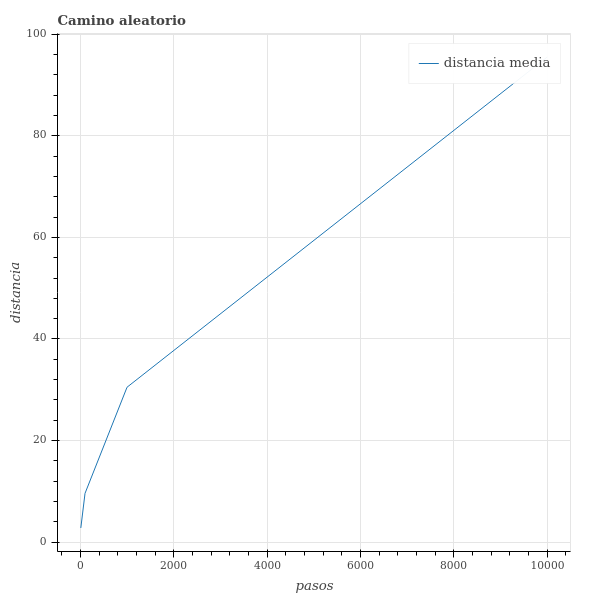
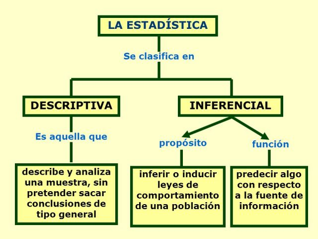
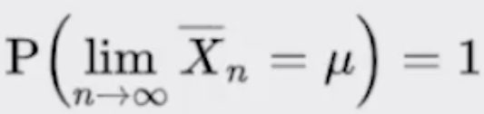
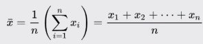
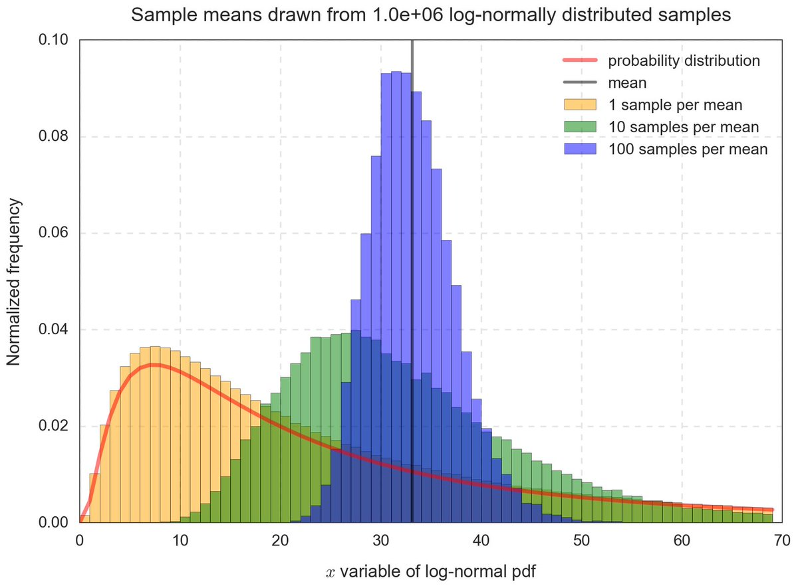

<div align="center">
  <h1>Programación Dinámica y Estocástica con Python</h1>
</div>

<div align="center"> 
  
</div>

# Introducción al documento

El contenido de este documento son apuntes del [Curso de Programación Dinámica y Estocástica con Python](https://platzi.com/clases/programacion-estocastica/) y busca ser una guía. El mismo está dictado por [David Aroesti](https://github.com/jdaroesti) del team [Platzi](https://platzi.com).


### Objetivos del documento
- Aprender cuándo utilizar Programación Dinámica y sus beneficios.
- Entender la diferencia entre programas deterministas y estocásticos.
- Aprender a utilizar Programación Estocástica.
- Aprender a crear simulaciones computacionales válidas.


# Tabla de contenido

- [Programación Dinámica](#Programación-Dinámica)
    - [Introducción a la Programación Dinámica](#Introducción-a-la-Programación-Dinámica)
    - [Optimización de Fibonacci](#Optimización-de-Fibonacci)
- [Caminos Aleatorios](#Caminos-Aleatorios)
    - [¿Qué son los caminos aleatorios?](#¿Qué-son-los-caminos-aleatorios?)
    - [Camino de Borrachos](#Camino-de-Borrachos)
- [Programas Estocásticos](#Programas-Estocásticos)
    - [Introducción a la Programación Estocástica](#Introducción-a-la-Programación-Estocástica)
    - [Cálculo de Probabilidades](#Cálculo-de-Probabilidades)
    - [Simulación de Probabilidades](#Simulación-de-Probabilidades)
    - [Inferencia Estadística](#Inferencia-Estadística)
    - [Media](#Media)
    - [Varianza y Desviación Estándar](#Varianza-y-Desviación-Estándar)
    - [Distribución Normal](#Distribución-Normal)
- [Simulaciones de Montecarlo](#Simulaciones-de-Montecarlo)
    - [¿Qué son las Simulaciones de Montecarlo?](#¿Qué-son-las-Simulaciones-de-Montecarlo?)
      - [Origen](#Origen)
      - [Simulaciones de montecarlo](#Simulaciones-de-montecarlo)
    - [Simulación de Barajas](#Simulación-de-Barajas)
    - [Cálculo de PI](#Cálculo-de-PI)
- [Muestreo e Intervalos de Confianza](#Muestreo-e-Intervalos-de-Confianza)
    - [Muestreo](#Muestreo)
    - [Teorema del Límite Central](#Teorema-del-Límite-Central)
- [Datos Experimentales](#Datos-Experimentales)
    - [¿Cómo trabajar con datos experimentales?](#¿Cómo-trabajar-con-datos-experimentales?)
    - [Regresión Lineal](#Regresión-Lineal)


## Programación Dinámica

### Introducción a la Programación Dinámica

<div align="center"> 
  
</div>

[Richard Bellman](https://es.wikipedia.org/wiki/Richard_Bellman) fue quien puso el nombre de [Programación Dinámica](https://es.wikipedia.org/wiki/Programaci%C3%B3n_din%C3%A1mica) pero este  no tiene ninguna relación con lo que el nombre proyecta. El origen de este se dio para que los patrocinadores vieran esto como algo atractivo matemáticamente hablando. 

Ya sabiendo que Programación Dinámica no esta relacionado con su nombre, lo cierto es que si es una de las técnicas mas poderosas para poder optimizar cierto tipos de problemas.

Los problemas que puede optimizar son aquellos que tienen una subestructura óptima, esto significa que **una solución óptima global se puede encontrar al combinar soluciones óptimas de subproblemas locales**.

También nos podemos encontrar con los **problemas empalmados**, los cuales implican resolver el mismo problema en varias ocasiones para dar con una solución óptima.

Una técnica para obtener una alta velocidad en nuestro programa es la Memorización, el cual consiste en guardar cómputos previos y evitar realizarlos nuevamente. Normalmente se utiliza un diccionario, donde las consultas se pueden hacer en O(1), y para ello hacemos un cambio de tiempo por espacio.

### Optimización de Fibonacci

La serie de _Fibonacci_ se representa como `Fn = Fn-1 + Fn-2` y es muy simple implementarla de forma recursiva en código. Sin embargo es muy ineficiente hacerlo simplemente recursivo, ya que repetimos varias veces el mismo computo.

<div align="center"> 
  
  <p>Algoritmo de Fibonnaci</p>
</div>

Si te fijas en la imagen te darás cuenta de que repetimos varias veces el calculo para `f(4), f(3), f(2), f(1) y f(0)`, esto significa que nuestro algoritmo crece de forma **exponencial** `O(2^n)`.

Para optimizar nuestro algoritmo implementaremos en primer lugar la **función recursiva** para luego dar paso a la **memorización**.

Sabiendo que en [complejidad algoritmica](https://github.com/francomanca93/Escuela-DataScience/blob/master/poo-y-algoritmos/CONTENIDO.md#Complejidad-algor%C3%ADtmica) podemos analizar un algoritmo desde lo temporal y lo espacial, lo que se hace es **intercambiar espacio** (en memoria) **por tiempo.** Con esto las mejoras serán realmente sorprendentes.

En la siguiente [practica](https://github.com/francomanca93/Escuela-DataScience/blob/master/programacion-dinamica-y-estocastica/programacion_dinamica.py) podemos ver dos funciones aplicando recursividad. En una es unicamente recursividad, en la otra se aplica recursividad y memorización. Esto me permite calcular numeros más grandes de fibonacci de forma mas eficiente. 

## Caminos Aleatorios
###      ¿Qué son los caminos aleatorios?

Los [**caminos aleatorios**](https://es.wikipedia.org/wiki/Camino_aleatorio) son un tipo de simulación que elige aleatoriamente una decisión dentro de un conjunto de decisiones válidas. Se utiliza en muchos campos del conocimiento cuando los sistemas no son deterministas e incluyen elementos de aleatoriedad.

Ejemplo en diferentes ciencias donde se se observan los caminos aleatorios:

- En genética de poblaciones
  - El camino aleatorio describe las propiedades estadísticas de la [**deriva genética**](https://es.wikipedia.org/wiki/Deriva_gen%C3%A9tica).

- En física, 
  - Usamos modelos simplificados del [**movimiento browniano**](https://es.wikipedia.org/wiki/Movimiento_browniano) y difusión tales como el movimiento aleatorio de las moléculas en líquidos y gases. Véase, por ejemplo, la agregación limitada por difusión. 
  - Los caminos aleatorios y algunos de los caminos que interactúan consigo mismos juegan un papel en la [**teoría cuántica de campos**](https://es.wikipedia.org/wiki/Teor%C3%ADa_cu%C3%A1ntica_de_campos).

- En biología matemática, 
  - Los caminos aleatorios son utilizados para describir movimientos individuales de los animales y como esto contribuye a los [**movimientos colectivos**](https://es.wikipedia.org/wiki/Comportamiento_colectivo_de_los_animales) de estos, 
  - En ocasiones para desarrollar la [**dinámica de poblaciones**](https://es.wikipedia.org/wiki/Din%C3%A1mica_de_poblaciones).

- En matemáticas,
  - El camino aleatorio se utiliza para calcular las soluciones de la [**ecuación de Laplace**](https://es.wikipedia.org/wiki/Ecuaci%C3%B3n_de_Laplace). 
  - Para estimar la [**media armónica**](https://es.wikipedia.org/wiki/Media_arm%C3%B3nica).
  - Para varias construcciones en el análisis y la [**combinatoria**](https://es.wikipedia.org/wiki/Combinatoria).

- En informática, 
  - Los caminos aleatorios son utilizados para estimar el tamaño de la Web. En la World Wide Web conference-2006, Bar-Yossef et al. publicó sus descubrimientos y algoritmos para lo mismo.
  - En el procesamiento de imágenes, los caminos aleatorios son utilizados para determinar las etiquetas (es decir, “objeto” o “fondo”) para asociarlas con cada píxel. Este algoritmo se suele denominar como algoritmo de segmentación del camino aleatorio.

###      Camino de Borrachos

Este es un ejercicio donde empezando desde un punto 0 aleatoriamente podemos decidir que dirección tomar, dependiendo de las opciones establecidas.

Para realizar un ejemplo de aleatoriedad vamos a crear un programa que representara el problema del "Camino de Borrachos". Crearemos 3 clases: 

- [Borracho](https://github.com/francomanca93/Escuela-DataScience/blob/master/programacion-dinamica-y-estocastica/camino_de_borrachos/borracho.py): Representa al agente que camina.

- [Coordenada](https://github.com/francomanca93/Escuela-DataScience/blob/master/programacion-dinamica-y-estocastica/camino_de_borrachos/coordenada.py): Genera una abstracción de las coordenadas.

- [Campo](https://github.com/francomanca93/Escuela-DataScience/blob/master/programacion-dinamica-y-estocastica/camino_de_borrachos/campo.py): Representa el plano en el cual nos estamos moviendo.

Con esto luego vamos a graficar la distancia en la que termina nuestro agente a medida que definimos una mayor cantidad de pasos que puede dar en nuestra archivo principal [camino_aleatorio](https://github.com/francomanca93/Escuela-DataScience/blob/master/programacion-dinamica-y-estocastica/camino_de_borrachos/camino_aleatorio.py). 

Para realizar todo esto debemos crear un ambiente virtual para utlizar finalmente la libreria bokeh que nos permitira graficar:

```py
mkdir camino_de_borramos    # Creamos una carpeta para nuestro proyecto.
cd camino_de_borrachos      # Ingresamos a la carpeta.
python3 -m venv env         # Creamos nuestro ambiente virtual.
source env/bin/activate     # Activamos nuestro ambiente.
pip install bokeh           # Instalamos el paquete de bokeh para generar nuestra gráfica.

```

Dentro el pensamiento estocástico debemos realizar varias simulaciones, por ese motivo en el ejemplo anterior realizamos varios intentos. Lo importante de esta aleatoriedad es que podemos distribuirla a lo largo de varios intentos, con esto podemos obtener certeza de que el comportamiento de nuestro programa se comporte en que esperamos estadísticamente.

```
# Como salida tenemos:

BorrachoTradicional caminata aleatorio de 10 pasos
Media = 2.814
Maxima = 7.1
Minima = 0.0
BorrachoTradicional caminata aleatorio de 100 pasos
Media = 9.621
Maxima = 29.7
Minima = 0.0
BorrachoTradicional caminata aleatorio de 1000 pasos
Media = 30.506
Maxima = 63.7
Minima = 3.2
BorrachoTradicional caminata aleatorio de 10000 pasos
Media = 95.481
Maxima = 269.6
Minima = 18.6
```

Con la siguiente gráfica generada:

<div align="center"> 
  
  <p>Caminos aleatorios</p>
</div>

## Programas Estocásticos
###     Introducción a la Programación Estocástica

En un [programa determinístico](https://es.wikipedia.org/wiki/Algoritmo_determinista) si se conocen las entradas del algoritmo siempre producirá la misma salida, y la máquina interna pasará por la misma secuencia de estados. Este tipo de algoritmos ha sido el más estudiado durante la historia y por lo tanto resulta ser el tipo más familiar de los algoritmos, así como el más práctico ya que puede ejecutarse en las máquinas eficientemente. 

Los programas determinísticos son muy importantes, pero existen problemas que no pueden resolverse de esa manera.

La programación [estocástica](https://es.wikipedia.org/wiki/Proceso_estoc%C3%A1stico) permite introducir aleatoriedad a nuestros programas para crear simulaciones que permiten resolver otro tipo de problemas. Los programas estocásticos se aprovechan de que las distribuciones probabilísticas de un problema se conocen o pueden ser estimadas.

###     Cálculo de Probabilidades

La [**probabilidad**](https://es.wikipedia.org/wiki/Probabilidad) es una medida de la certidumbre asociada a un evento o suceso futuro y suele expresarse como un número entre 0 y 1.

Una probabilidad de 0 significa que un suceso jamás sucederá, y en su contraparte una probabilidad de 1 significa que está garantizado que sucederá.

Al hablar de probabilidad preguntamos qué fracción de todos los posibles eventos tiene la propiedad que buscamos, por eso es importante poder calcular todas las posibilidades de un evento para entender su probabilidad. La probabilidad de que un evento suceda y de que no suceda es siempre 1.

Si A y B son eventos separados podemos analizar las leyes basicas de la probabilidad:

- Ley del complemento:
    
      P(A) + P(~A) = 1

Lo anterior se lee: La probabilidad de que **ocurra el evento A** mas la probabilidad de que **NO ocurra el evento A** es igual a 1.

- Ley multiplicativa:
  
      P(A y B) = P(A) * P(B)

Lo anterior se lee: La probabilidad de que **ocurra el evento A y B** es igual al producto de las probabilidades de cada evento por separado.

- Ley aditiva:
  - Mutuamente exclusivos: 
  
        P(A o B) = P(A) + P(B)
    
Lo anterior se lee: La probabilidad de que **ocurra el evento A o B** es igual a la suma de las probabilidades de cada evento por separado.

  - No exclusivos: 
  
        P(A o B) = P(A) + P(B) - P(A y B)


Para ver un ejemplo práctico de las leyes anteriores vamos a realizar un ejercicio de el lanzamiento de un dado de 6 caras:

- La probabilidad de que salga el número 1:

Tenemos 6 posibilidades y el número 1 es una de ellas, por lo que la probabilidad es 1/6.

- La probabilidad de que nos toque el numero 1 o 2:

Tenemos 6 posibilidades y el número 1 es una de ellas y el 2 es otra. El que nos toque un número es mutuamente exclusivo, ya que no podemos obtener 2 números al mismo tiempo. Bajo esta premisa utilizaremos la ley aditiva mutuamente exclusiva.

    P(1 o 2) = P(1) + P(2)

    P(1 o 2) = 1/6 + 1/6

    P(1 o 2) = 2/6

- La probabilidad de que nos salga el número 1 al menos 1 vez en 10 lanzamientos:

    Para cada lanzamiento tenemos la posibilidad de 1/6 de que nos toque 1, por lo que utilizamos la ley multiplicativa.

      (1/6)^10 = 0.8333


###     Simulación de Probabilidades

En la siguiente [práctica](https://github.com/francomanca93/Escuela-DataScience/blob/master/programacion-dinamica-y-estocastica/probabilidades.py) crearemos un ejemplo de lanzar un dado de 6 caras, esto con el objetivo de obtener la distribución de probabilidades y acercarnos al numero correcto, aplicando la **ley de los grandes números**.

###     Inferencia Estadística

Con las simulaciones podemos calcular las probabilidades de eventos complejos sabiendo las probabilidades de eventos simples.

¿Que pasa cuando no sabemos las probabilidades de los eventos simples? 

Podemos aplicar las técnicas de la [inferencia estadística](https://es.wikipedia.org/wiki/Estad%C3%ADstica_inferencial) la cual nos permiten inferir/concluir las propiedades de una población a partir de una muestra aleatoria.

>"El principio guía de la inferencia estadística es que una muestra aleatoria tiende a exhibir las mismas propiedades que la población de la cual fue extraída." - John Guttag

<div align="center"> 
  
  <p>Inferencia estadística</p>
</div>

Sabiendo esto vemos que la estadística se clasifica en dos tipos. 

<div align="center"> 
  
  <p>Inferencia estadística</p>
</div>

#### Ley de los grandes números

Con la ley de los grandes números podemos ver que en pruebas independientes repetidas con la misma probabilidad p de un resultado, la fracción de desviaciones de p converge a cero conforme la cantidad de pruebas se acerca al infinito.


<div align="center"> 
  
  <p><b>Ley de los grandes números</b></p>
</div>

#### Falacia del apostador

La [**falacia del apostador**](https://es.wikipedia.org/wiki/Falacia_del_apostador) una falacia lógica por la que se cree erróneamente que los sucesos pasados afectan a los futuros en lo relativo a actividades aleatorias, como en muchos juegos de azar. Puede comprender las siguientes ideas equivocadas:

- Un suceso aleatorio tiene **más** probabilidad de ocurrir porque **no** ha ocurrido durante cierto período.
- Un suceso aleatorio tiene **menos** probabilidad de ocurrir porque ha ocurrido durante cierto período.
- Un suceso aleatorio tiene **más** probabilidad de ocurrir si **no ocurrió recientemente**.
- Un suceso aleatorio tiene **menos** probabilidad de ocurrir **si ocurrió recientemente.**

Las anteriores son ideas equivocadas que surgen cotidianamente en razonamientos sobre probabilidades, muchos de los cuales se han estudiado con gran profundidad. Mucha gente pierde dinero apostando debido a su creencia errónea en esta falacia. 

**La regresion a la media señala que después de un evento aleatorio extremo, el siguiente evento probablemente será menos extremo.**

###     Media

La [**media**](https://es.wikipedia.org/wiki/Media_aritm%C3%A9tica) es una medida de tendencia central, comúnmente conocido como promedio. La media de una población se denota con el símbolo μ y la media de una muestra se define con X̄.

<div align="center"> 
  
  <p><b>Promedio</b></p>
</div>

En el siguiente código calculamos la media.
```py
import random

def media(X):
    return sum(X) / len(X)

if __name__ == '__main__':
    X = [random.randint(0, 20) for i in range(20)] 
    mu = media(X)

    print(X)
    print(mu)
```

###     Varianza y Desviación Estándar

La [varianza](https://es.wikipedia.org/wiki/Varianza) mide qué tan propagados se encuentran un conjunto de valores aleatorios de su media. Mientras que la media nos da una idea de dónde se encuentran los valores, la varianza nos dice que tan dispersos se encuentran. La varianza siempre debe entenderse con respecto a la media.

<div align="center"> 
  
  <p><b>Varianza</b></p>
</div>

La [desviación estándar](https://es.wikipedia.org/wiki/Desviaci%C3%B3n_t%C3%ADpica) es la raíz cuadrada de la varianza. Nos permite entender, también, la propagación y se debe entender siempre relacionado con la media.

<div align="center"> 
  
  <p><b>Desviación estandar</b></p>
</div>

La ventaja sobre la varianza es que la desviación estándar está en las mismas unidades que la media.

En el siguiente codigo implementaré las funciones de varianza y desviación estándar en nuestro [script](https://github.com/francomanca93/Escuela-DataScience/blob/master/programacion-dinamica-y-estocastica/estadisticas.py) ya hecho para la media.

```py
import random
import math

def media(X):
    return sum(X) / len(X)

def varianza(X):
    mu = media(X)

    acumulador = 0
    for x in X:
        acumulador += (x - mu)**2
    
    return acumulador / len(X)

def desviacion_estandar(X):
    return math.sqrt(varianza(X))


if __name__ == '__main__':
    X = [random.randint(9, 12) for i in range(20)] 
    mu = media(X)
    Var = varianza(X)
    sigma = desviacion_estandar(X)

    print(f'Arregla X: {X}')
    print(f'Media = {mu}')
    print(f'Varianza = {Var}')
    print(f'Desviacion estandar = {sigma}')
```

###     Distribución Normal

La [**distribución normal**](https://es.wikipedia.org/wiki/Distribuci%C3%B3n_normal) es una de las distribuciones mas recurrentes en cualquier ámbito. Se define completamente por su media y su desviación estándar. Permite calcular intervalos de confianza con la regla empírica.

<div align="center"> 
  
  <p><b>Distribución normal</b></p>
</div>


Cuando graficamos la función de densidad de probabilidad vemos que es totalmente simétrica rescpecto a la **media**. 

En el siguiente ejemplo vamos unas distribuciones con medias 0 y desviación estándar 0.2, 1 y 5, excepto una que se modifico la media a -2 y distribución estandar 0.5.

Cuando la desviación es baja significa la variabilidad o dispersión de los datos es menor.


<div align="center"> 
  
  <p><b>Función de densidad de probabilidad</b></p>
</div>

Ejemplo de donde podría utilizarse esto:
- Inversion: Cuando se analizar una inversión se desea saber la **media de retorno** de la misma y la **desviación estandar** nos va a decir el riesgo de la inversión.
  - Si tiene una **media de rotorno** elevada y una **desviación estándar** pequeña será una inversión **segura**.
  - Si tienes la misma **media de retorno** elevada pero con una **disviación estándar** alta, podemos decir que nuestra inversión será mas riesgosa.
De esta forma evaluamos si aceptamos el riesgo o no


#### Regla empírica

También conocida como la **regla 68-95-99.7**. Señala cuál es la dispersión de los datos en una distribución normal a **uno, dos y tres sigmas**. Hay que tener en cuenta que los 2 extremos de la grafica tendrán un comportamiento similar.

Tambien permite calcular probabilidades con la densidad de la distribución normal.

<div align="center"> 
  
  <p><b>Regla empírica</b></p>
</div>

<div align="center"> 
  
  <p><b>Histograma de desviación estandar</b></p>
</div>

<div align="center"> 
  
  <p><b>Diagrama de desviación estandar</b></p>
</div>

## Simulaciones de Montecarlo
###     ¿Qué son las Simulaciones de Montecarlo?

#### Origen
La [invención del método](https://es.wikipedia.org/wiki/M%C3%A9todo_de_Montecarlo#Or%C3%ADgenes_del_m%C3%A9todo) se las asigna a [Stanislaw Ulam](https://es.wikipedia.org/wiki/Stanis%C5%82aw_Ulam) y a [John von Neumann](https://es.wikipedia.org/wiki/John_von_Neumann). 


<div align="center"> 
  
  <p><b>Stanislaw Ulam</b></p>


  <p><b>John von Neumann</b></p>

</div>

Ulam aburrido y enfermo en su casa queria calcular la probabilidad de cual era el juego perfecto del solitario y saber cuando podia ganar o perder. Sabiendo que calcular con lapiz y papel le iba a llevar mucho tiempo, llamo a su amigo Von Neumann para poder usar la computadora [ENIAC](https://es.wikipedia.org/wiki/ENIAC) y desarrollar la simulación. 

<div align="center"> 
  
  <p><b>Stanislaw Ulam</b></p>
</div>

Desarrollando la modelación se dieron cuenta que estaban llegando a aproximaciones muy reales del solitario. Con esto quiseron modelar los juegos de azar de Montecarlo. De aca se le atribuye el nombre de [simulaciones de Montecarlo](https://es.wikipedia.org/wiki/M%C3%A9todo_de_Montecarlo). 

No solo modelaron juegos de casino si no que tambien lo utilizaron para el [proyecto Manhattan](https://es.wikipedia.org/wiki/Proyecto_Manhattan). Hicieron simulaciones probabilisticas para saber que podría suceder con las bombas que se estaban desarrollando. 

#### Simulaciones de montecarlo

Permite crear simulaciones para predecir el resultado de un problema, además de convertir problemas determinísticos en problemas estocásticos.

Es utilizado en gran diversidad de áreas, desde la ingeniería hasta la biología y el derecho.

###     Simulación de Barajas

Con la simulaciones de Montecarlo podemos simular un juego de cartas. En este caso, obtener las probabilidades de algun juego especifico. 

Nuestro juego será el [Poker](https://es.wikipedia.org/wiki/P%C3%B3quer). Antes de simular tenemos que saber de como se compone el [naipe francés](https://es.wikipedia.org/wiki/Baraja_francesa) y cuales son las posibles combinaciones de cartas del poker.

<div align="center"> 
  
  <p><b>Naipe Francés</b></p>


  <p><b>Combinacion de cartas de Poker</b></p>

</div>

En el [siguiente código](https://github.com/francomanca93/Escuela-DataScience/blob/master/programacion-dinamica-y-estocastica/barajas.py) podemos calcular las probabilidades de los juegos. En este caso solo se realizo la simulación para el cálculo de la probabilidad de par, escalera y escalera de color. 

###     Cálculo de PI

Explicación de la metodología del [cálculo de Pi con el Método de Montecarlo](https://youtu.be/DQ5qqHukkAc?t=149) en Youtube por [QuantumFracture](https://www.youtube.com/channel/UCbdSYaPD-lr1kW27UJuk8Pw). 

Calcularemos PI con puntos al azar esparcidos en un plano cartesiano utilizando el [script de estadísticas](https://github.com/francomanca93/Escuela-DataScience/blob/master/programacion-dinamica-y-estocastica/estadisticas.py) y utilizaremos las funciones de desviación estándar y media que creadas. Queremos tener un 95% de certeza.

En el sigueinte [script](https://github.com/francomanca93/Escuela-DataScience/blob/master/programacion-dinamica-y-estocastica/calculo_pi.py) tenemos el cálculo de Pi utilizando las simulaciones de montecarlo.

```py
import random
import math
from estadisticas import desviacion_estandar, media

def arrojar_agujas(numero_de_agujas):
    '''Función que sirve para arrojar agujas.

    - El bucle calcula cada distancia de las agujas que se arrojan representadas por puntos.
    - Si la distancia del centro es menor a 1, la aguja se encuentra dentro del circulo.
    - return int: 4 * (adentro_del_circulo / numero_de_agujas)
    '''

    adentro_del_circulo = 0
    
    for _ in range(numero_de_agujas):
        x = random.random() * random.choice([-1, 1])
        y = random.random() * random.choice([-1, 1])
        distancia_desde_el_centro = math.sqrt(x**2 + y**2)

        if distancia_desde_el_centro <= 1:
            adentro_del_circulo += 1
    
    return 4 * (adentro_del_circulo / numero_de_agujas)

def estimacion(numero_de_agujas, numero_de_intentos):
    '''Función que sirve para estimar la media y la desviacion estandar de los numeros de intentos.

    - El bucle sirve para agregar cada estimación de pi.
    - return tupla: (media_estimados, sigma)
    '''
    estimados = []

    for _ in range(numero_de_intentos):
        estimacion_de_py = arrojar_agujas(numero_de_agujas)
        estimados.append(estimacion_de_py)
    
    media_estimados = media(estimados)
    sigma = desviacion_estandar(estimados)
    print(f'Media de estimados = {round(media_estimados, 5)}, Desviación estandar = {round(sigma, 5)}, Agujas = {numero_de_agujas}')

    return (media_estimados, sigma)

def estimar_pi(precision, numero_de_intentos):
    '''Función que me permite estimar el numero pi'''

    numero_de_agujas = 1000
    sigma = precision

    while sigma >= precision / 1.96:
        media, sigma = estimacion(numero_de_agujas, numero_de_intentos)
        numero_de_agujas *= 2 
    
    return media

if __name__ == "__main__":
    estimar_pi(0.01, 1000)
```


```
# Salida del código

Media de estimados = 3.14216, Desviación estandar = 0.05133, Agujas = 1000
Media de estimados = 3.14121, Desviación estandar = 0.03646, Agujas = 2000
Media de estimados = 3.14203, Desviación estandar = 0.02561, Agujas = 4000
Media de estimados = 3.14109, Desviación estandar = 0.01793, Agujas = 8000
Media de estimados = 3.141, Desviación estandar = 0.01335, Agujas = 16000
Media de estimados = 3.14178, Desviación estandar = 0.00887, Agujas = 32000
Media de estimados = 3.14151, Desviación estandar = 0.00646, Agujas = 64000

```

## Muestreo e Intervalos de Confianza

###     Muestreo

El [muestreo](https://es.wikipedia.org/wiki/Muestreo_(estad%C3%ADstica)) es muy importante cuando no tenemos acceso a toda la población que queremos explorar. Uno de los grandes descubrimientos de la estadística es que las muestras aleatorias tienden a mostrar las mismas propiedades de la población objetivo. Hasta este punto todos los muestreos que se han realizado en los scripts de este documento han sido de tipo probabilísticos.

En un **muestreo aleatorio** cualquier miembro de la población tiene la misma probabilidad de ser escogido.

En un **muestreo estratificado** tomamos en consideración las características de la población para partirla en subgrupos y luego tomamos muestras de cada subgrupo, esto incrementa la probabilidad de que el muestreo sea representativo de la población.

###     Teorema del Límite Central

El [teorema del límite central](https://es.wikipedia.org/wiki/Teorema_del_l%C3%ADmite_central) es uno de los teoremas más importantes de la estadística. Establece que mientras mas **muestras aleatorias** obtengamos de cualquier distribución estas van a tender a una **distribución normal**. Mientras la muestra sea de mayor tamaño, la desviación estándar será menor.

Esto permite entender cualquier distribución como la distribución normal de sus medias y eso nos permite aplicar todo lo que sabemos de distribuciones normales.

<div align="center"> 
  
  <p><b></b></p>


  <p><b>Varios ejemplos del Teorema del limite central</b></p>
</div>

La siguiente [página](http://195.134.76.37/applets/AppletCentralLimit/Appl_CentralLimit2.html) me permite simular varios casos utilizando el teorema del limite central.

## Datos Experimentales
###     ¿Cómo trabajar con datos experimentales?

Los datos experimentales son aquellos que se generan a través del [método científico](https://es.wikipedia.org/wiki/M%C3%A9todo_cient%C3%ADfico).

- Con el método científico es necesario comenzar con una teoría o hipótesis sobre el resultado al que se quiere llegar.
- Basado en la hipótesis se debe crear un experimento para validad o falsear la hipótesis.
- Se valida o falsea una hipótesis midiendo la diferencia entre las mediciones experimentales y aquellas mediciones predichas por la hipótesis.

<div align="center"> 
  
  <p><b></b></p>
</div>

###     Regresión Lineal
La [regresión lineal](https://es.wikipedia.org/wiki/Regresi%C3%B3n_lineal) nos permite aproximar una función a un conjunto de datos obtenidos de manera experimental. No necesariamente permite aproximar funciones lineales, sino que sus variantes permiten aproximar cualquier función polinómica.

```py
import numpy as np
x = np.array([0, 1, 2, 3, 4, 5, 6, 7, 8])
y = np.array([1, 2, 3, 5, 4, 6, 8, 7, 9])

coeffs = np.polyfit(x, y, 1)
print(coeffs)
```
```
# Salida del código
[0.96666667 1.13333333]
```

```py
m = coeffs[0]
b = coeffs[1]
est_y = (m * x) + b

import matplotlib.pyplot as plt
plt.plot(x, est_y)
plt.scatter(x, y)
plt.show()
```

<div align="center"> 
  
  <p><b>Regresión lineal</b></p>
</div>

### Conclusiones

- La programación dinámica permite optimizar problemas que tienen subestructura optima y subproblemas empalmados.
- Las computadoras pueden resolver problemas determinísticos y estocásticos.
- Podemos generar simulaciones computacionales para responder preguntas del mundo real. 
- La inferencia estadística nos permite tener confianza de que nuestras simulaciones arrojan resultados válidos.

***
Volver a la [tabla de contenido principal de la Escuela de Data Science](https://github.com/francomanca93/Escuela-DataScience)

Continuar con [Introducción al Pensamiento Probabilístico ](https://github.com/francomanca93/Escuela-DataScience/blob/master/introduccion-al-pensamiento-probabilistico/README.md)